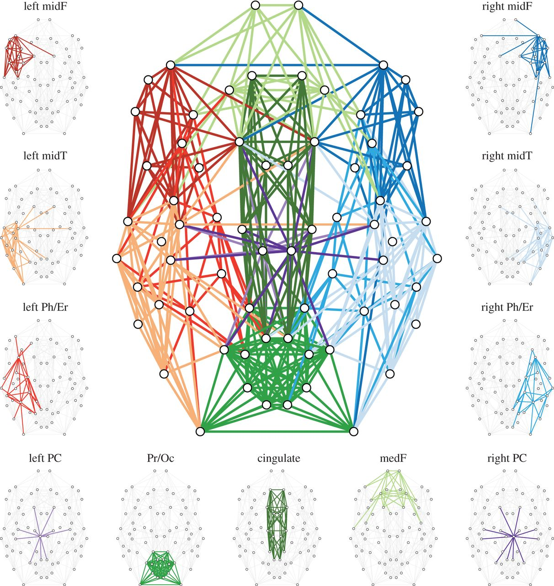
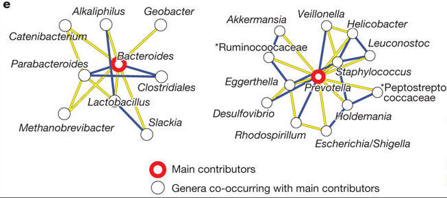
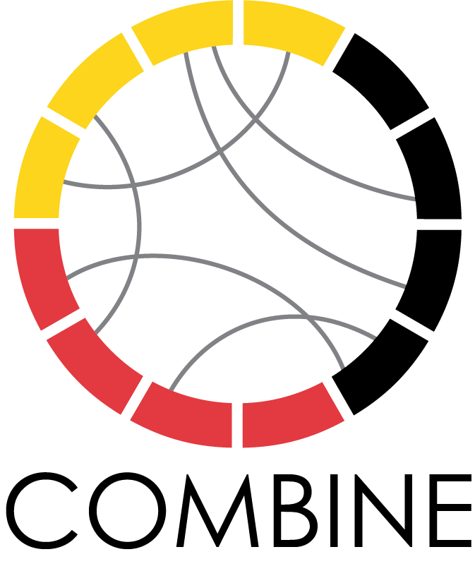

class: title-slide, center, middle
count: false

.banner[]

.title[Biological Networks Across Scales: Course Overview]

.author[Héctor Corrada Bravo]

.other-info[
University of Maryland, College Park, USA  
CMSC828O `r Sys.Date()`
]

.logo[]

---
class: split-50
exclude: true

## What does my group do?

.column[
Study the **molecular** basis of *variation* in development and disease


Using **high-throughput** experimental methods  
]

.column[.image-80[]]

---

## Course Information

### Course webpage

- http://www.hcbravo.org/networks-across-scales/
- Shortened: http://bit.ly/hcb-nas

### Other sites

- **ELMS**: Grades, assignments, readings, etc.
- **Piazza**: Discussion and any other communication
- Links in course webpage


---
class: middle, center


.image-70[]

---
class: middle, center

## A Molecular Pathway

```{r pathway_setup, echo=FALSE, message=FALSE}
library(graphite)
library(stringr)
library(magrittr)
library(Rgraphviz)
```

```{r pathway_compute, echo=FALSE, cache=TRUE, warnings=FALSE, message=FALSE}
p <- pathways("hsapiens", "reactome")
pathname <- names(p) %>% str_subset("Metal") %>% extract(1)
pg <- p[[pathname]] %>% 
  convertIdentifiers("symbol") %>% 
  pathwayGraph() %>%
  layoutGraph()

```

```{r pathway_plot, echo=FALSE, fig.height=4, fig.width=10}
graph.par(list(nodes=list(fontsize=32,lty="dotted")))
renderGraph(pg)
```

.small[`r pathname`]

---

## Course Components

- Network Analysis Methods
- Biological Networks
- Data Projects

---
class: split-50

## Networks Analysis Methods

.column[
Module 1: Network Properties and Characteristics
]

.column[
```{r, echo=FALSE, fig.width=5, fig.height=4}
renderGraph(pg)
```
]

---
class: split-50

## Networks Analysis Methods

.column[
Module 2: Network Models  

_Networks as representation of systems_  
]

.column[
```{r, echo=FALSE, fig.width=5, fig.height=4}
renderGraph(pg)
```
]

---
class: split-50

## Networks Analysis Methods

.column[
Module 3: Statistical Analysis of Networked Data  

_Networks as representation of (in)-dependence_
]

.column[
```{r, echo=FALSE, fig.width=5, fig.height=4}
renderGraph(pg)
```
]

---
class: split-50

## Networks Analysis Methods

.column[
Module 4: Network Visualization
]

.column[
```{r, echo=FALSE, fig.width=5, fig.height=4}
renderGraph(pg)
```
]

---

## Biological Networks

Student-led Presentations

.center[.image-60[]]

---

## Molecular Networks

```{r, echo=FALSE, fig.width=9, fig.height=4.5, fig.align="center"}
renderGraph(pg)
```

---

## Cellular Networks

.center[.image-40[]]

.source[http://rstb.royalsocietypublishing.org/content/369/1653/20130527]

---

## Ecological Networks

.center[]

.source[https://doi.org/10.1038/nature09944]
---

## Data Projects

Semester-long projects

- Data from Biological Networks
- Apply Methodology as we go along
- Milestone presentations (and submissions)
- Submit final report

---
class: split-50

## COMBINE Training Program

.column[
.center[.image-50[]]
http://combine.umd.edu
]

.column[
- NSF funded training grant in biological networks 
- Two courses: this one, course in research and science communication (Girvan/Serrano)
- Fellows from many research areas
- Training programs are **FANTASTIC**
  - Cohort
  - Focus
]