class: title-slide, center, middle
count: false

.banner[]

.title[Dynamical Processes over Networks]

.author[Héctor Corrada Bravo]

.other-info[
University of Maryland, College Park, USA  
CMSC828O `r Sys.Date()`
]

.logo[]

---
class: split-50
exclude: true

## What does my group do?

.column[
Study the **molecular** basis of *variation* in development and disease

Using **high-throughput** experimental methods  
]

.column[.image-80[]]

---
class: split-30

## Modeling epidemics over Networks

.column[
First analysis of dynamical processes over
networks

Will let us exercise some of the ways of thinking about
these processes
]

.column[
.center.image-60[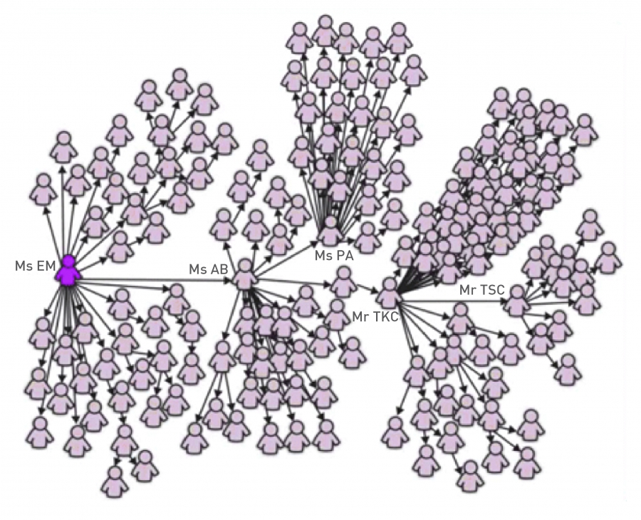]
]

---

## Modeling epidemics over Networks

**Questions**

Are there network properties that predict spread of infection?

Are certain network types more resilient to infection than others?

If we can intervene (vaccinate) are there nodes in the network that are more effective to vaccinate?

--

We'll start by looking at spread over non-networked populations

---
class: split-50

## Susceptibility and infection (SI model)

.column[
Individuals in the population can be in two states

An infected individual can infect _any_ susceptible individual they are in contact with

If we start ( $t=0$ ) with some number of infected individuals ( $i_0$ ). How many infected individuals are there at time $t$?
]

.column[
.center.image-50[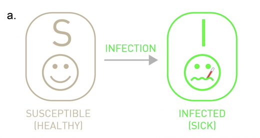]
]

---

## SI model

$$\frac{d}{dt}I(t) = \beta \langle k \rangle \frac{S(t)}{N}I(t)$$

$\langle k \rangle$, average number of contacts per individual in one time step

$\beta$, "rate" probability an I infects an S upon contact

--

$$\frac{di}{dt} = \beta \langle k \rangle i(1-i)$$

---
class: split-50

## SI model

.column[
Fraction of infected individuals in population

$$i(t) = \frac{i_0e^{\beta \langle k \rangle t}}{1-i_0+i_0e^{\beta \langle k \rangle t}}$$ 
Characteristic time ( $t$ s.t. $i(t)=1/e\approx .36$)
$$\tau = \frac{1}{\beta \langle k \rangle}$$
]

.column[
.center.image-50[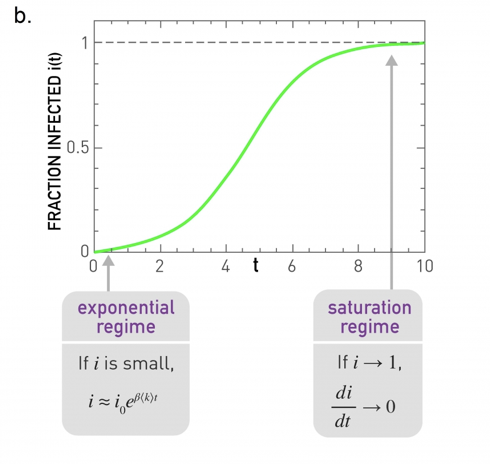]
]

---

## SIS model

Infection ends (recovery), individual becomes susceptible again

.center[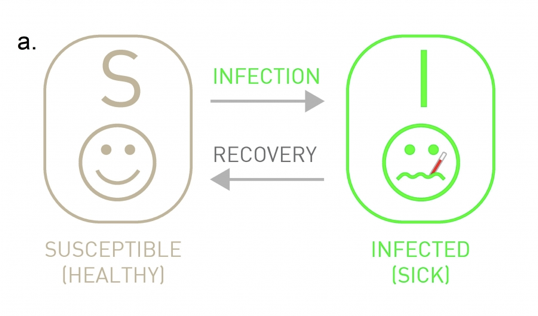]

---

## SIS model

$$\frac{di}{dt} = \beta \langle k \rangle i(1-i)-\mu i$$

$\mu$ - recovery rate

---
class: split-30

## SIS model

.column[
\begin{array}
x i(t) = \left( 1 - \frac{\mu}{\beta \langle k \rangle} \right)\times \\
\frac{Ce^{(\beta \langle k \rangle -\mu)t}}{1+Ce^{(\beta \langle k \rangle -\mu)t}}
\end{array}
]

.column[
.center.image-60[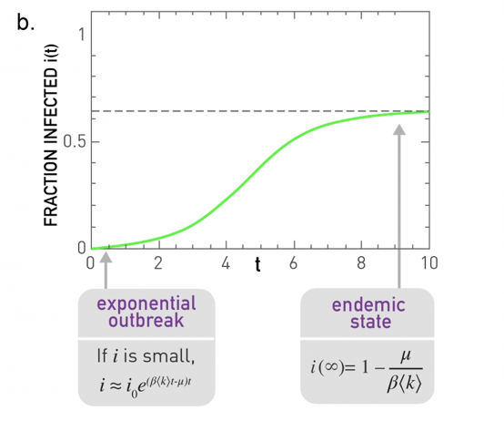]
]

---
class: split-30

## SIS model

.column[
**Endemic State** Pathogen persists in population after saturation

$$R_0 = \frac{\beta \langle k \rangle}{\mu} > 1$$

$$i(\infty) = 1 - \frac{\mu}{\beta \langle k \rangle} = 1-1/R_0$$
]

.column[
.center.image-60[]
]

---
class: split-30

## SIS model

.column[
**Disease-free State** Pathogen disappears from population

$$R_0 = \frac{\beta \langle k \rangle}{\mu} < 1$$

$$i(\infty) = 0$$
]

.column[
.center.image-60[]
]

---

## SIS model

**Basic Reproductive Number**

$$R_0=\frac{\beta \langle k \rangle}{\mu}$$

**Characteristic Time**

$$\tau = \frac{1}{\mu(R_0-1)}$$

---

## SIR model

Individuals **removed** after infection (either death or immunity)

.center.image-70[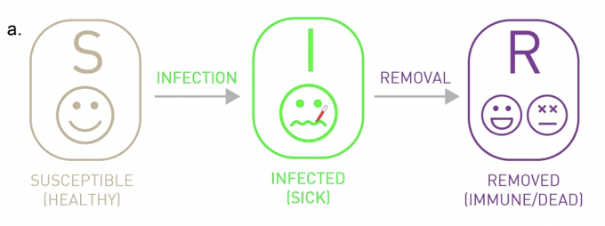]

---
class: split-30

## SIR model

.column[
\begin{array}
i\frac{di}{dt} = & \beta \langle k \rangle i (1-r-i) - \mu i \\
\frac{dr}{dt} = & \mu i \\
\frac{ds}{dt} = & - \beta \langle k \rangle i (1-r-i)
\end{array}
]

.column[
.center.image-70[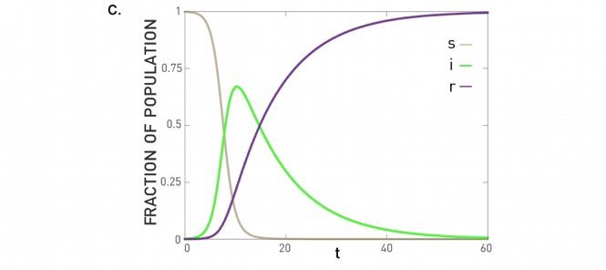]
]

---
class: split-30

## Summary

.column[
.center.image-50[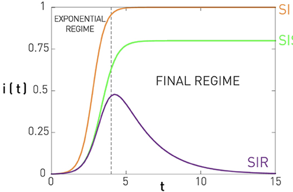]
]

.column[
.center.image-60[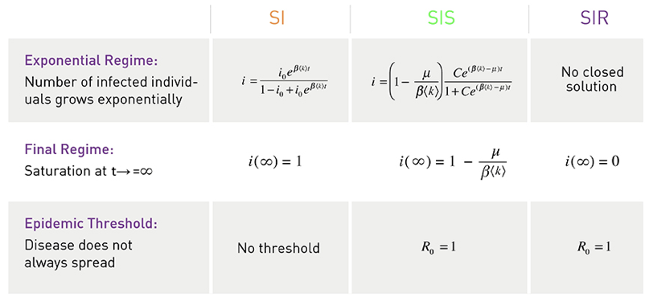]
]

---

## Epidemic processes over networks (SI)

Consider node $i$ in network:

$s_i(t)$ average probability node $i$ is *susceptible* at time $t$

$x_i(t)$ average probability node $i$ is *infected* at time $t$

---

## Epidemic processes over networks (SI)

$$\frac{ds_i}{dt} = - s_i \beta \sum_{j=1}^N a_{ij}x_j$$

$$\frac{dx_i}{dt} = s_i \beta \sum_{j=1}^N a_{ij} x_j$$

--

For large $N$, and early $t$

$$\frac{dx}{dt} = \beta Ax$$

---
class: split-40

## Eigenvalue decomposition of $A$

.column[
$$A = V^T\Lambda V$$

Any quantity $x_i$ over nodes in the graph can be written as

$$\mathbf{x} = \sum_{r=1}^N c_r \mathbf{v}_r$$
]
.column[
.center.image-50[]
]

---
class: split-40

## Eigenvalue decomposition of $A$

.column[
$$A\mathbf{v}_r = \lambda_r \mathbf{v}_r$$

$$\lambda_1 \geq \lambda_2 \geq \cdots \geq \lambda_N$$
]
.column[
.center.image-50[]
]

---

## Eigenvalue decomposition of $A$

Let's revisit centrality

$$\mathbf{x}(t) = A^t\mathbf{x}(0)=\sum_{r=1}^N c_r A^t \mathbf{v}_r$$

Then

$$\mathbf{x}(t) = \sum_{r=1}^N c_r \lambda_r^t \mathbf{v}_r=\lambda_1^t \sum_{i=1}^N c_r \left( \frac{\lambda_r}{\lambda_1}\right)^t \mathbf{v}_r$$

---

## Eigenvalue decomposition of $A$

As $t$ grows, first term dominates

$$\mathbf{x}(t) = c_1 \lambda_1^t \mathbf{v}_1$$

So set centrality $\mathbf{x}$ to be proportional to first *eigenvector* $\mathbf{v}_1$

--

In which case $x = Ax$ if $\mathbf{x}=\frac{1}{\lambda_1} \mathbf{v}_1$ as desired

---

## Back to epidemics (SI)

$\mathbf{x}(t)$ average probability each node is infected at time $t$

$$\frac{d\mathbf{x}}{dt} = \beta A \mathbf{x}$$

Can write as

$$\mathbf{x}(t) = \sum_{r=1}^N c_r(t) \mathbf{v}_r$$

---

## Back to epidemics (SI)

\begin{array}
i\frac{d\mathbf{x}}{dt} & = & \sum_{r=1}^N \frac{dc_r}{dt}\mathbf{v}_r \\
{} & = & \beta A \sum_{r=1}^N c_r(t) \mathbf{v}_r = \beta \sum_{r=1}^N \lambda_r c_r(t) \mathbf{v}_r
\end{array}

--

Implying

$$\frac{dc_r}{dt} = \beta \lambda_r c_r$$

--

With solution

$$c_r(t) = c_r(0) e^{\beta \lambda_r t}$$

---

## Back to epidemics (SI)

As before, first term dominates so

$$\mathbf{x}(t) \sim e^{\beta \lambda_1 t} \mathbf{v}_1$$

Eigen-centrality!

---

## Back to epidemics (SIR)

$$\frac{d\mathbf{x}}{dt} = \beta A \mathbf{x} - \mu \mathbf{x}$$

Similarily

$$\mathbf{x}(t) \sim e^{(\beta \lambda_1 - \mu)t}$$

--

Is there an epidemic? Not if $R_0=\frac{\beta}{\mu} = \frac{1}{\lambda_1}$

---
class: split-30

## Degree distributions and epidemics

.column[
**Degree Block Approximation** Assume that all nodes of the same degree are statistically equivalent
]

.column[
.center.image-60[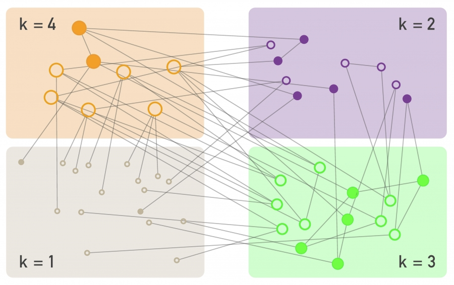]
]

---
class: split-30

## Degree distributions and epidemics

.column[
**Degree Block Approximation** Assume that all nodes of the same degree are statistically equivalent
]

.column[
.center.image-60[]
]

---

## Degree distributions and epidemics

**SI model**

Fraction of nodes of degree $k$ that are infected

$$i_k= \frac{I_k}{N_k}$$ 

$$\frac{di_k}{dt}=\beta(1-i_k)k\Theta_k$$

With $\Theta_k$ the fraction of infected neighbors for a node of degree $k$

---

## Degree distributions and epidemics

For early time and assuming no degree correlation

$$\frac{di_k}{dt} = \beta k i_0 \frac{\langle k \rangle -1}{\langle k \rangle} e^{t/\tau^{SI}}$$

with

$$\tau^{SI}=\frac{\langle k \rangle}{\beta(\langle k^2 \rangle - \langle k \rangle)}$$

---

## Degree distributions and epidemics

**Characteristic time**

$$\tau^{SI}=\frac{\langle k \rangle}{\beta(\langle k^2 \rangle - \langle k \rangle)}$$

For random networks  $\langle k^2 \rangle = \langle k \rangle (\langle k \rangle + 1)$ 

$$\tau^{SI}=\frac{1}{\beta \langle k \rangle}$$

---

## Degree distributions and epidemics

**Characteristic time**

$$\tau^{SI}=\frac{\langle k \rangle}{\beta(\langle k^2 \rangle - \langle k \rangle)}$$

For power law network $\gamma \geq 3$ $\langle k^2 \rangle$ is finite, characteristic time is finite

--

For power law $\gamma < 3$, $\langle k^2 \rangle$ does not converge as $N \to \infty$ so characteristic time goes to 0

---

## Degree distributions and epidemics

.center.middle[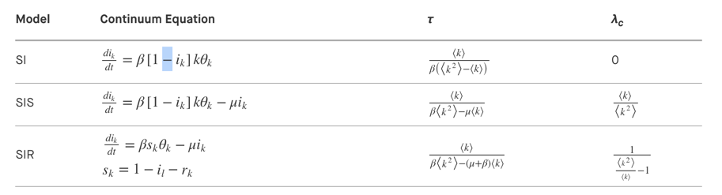]

---

## Immunization

Suppose a fraction $g$ of nodes is immunized (i.e. resistant)

Rate of infection in SIR model changes from 

$$\lambda=\frac{\beta}{\mu}$$

to

$$\lambda(1-g)$$

---

## Immunization

We can choose a fraction $g_c$ such that rate of infection is below epidemic threshold

For a random network

$$g_c = 1- \frac{\mu}{\beta}\frac{1}{\langle k \rangle + 1}$$

---

## Immunization

For a power-law network

$$g_c = 1-\frac{\mu}{\beta}\frac{\langle k \rangle}{\langle k^2 \rangle}$$

For high $\langle k^2 \rangle$ need to immunize almost the entire population

---

## Immunization

Immunization can be more effective if performed selectively.

In power law contact networks, what is the effect of immunizing high-degree nodes?

--

First, how do you find them?

Idea: choose individuals at random, ask them to nominate a neighbor in contact graph

---
class: split-50

## Immunization

.column[
What is the expected degree of the nominated neighbor?

$$\propto k p_k$$
]

.column[
.center.image-50[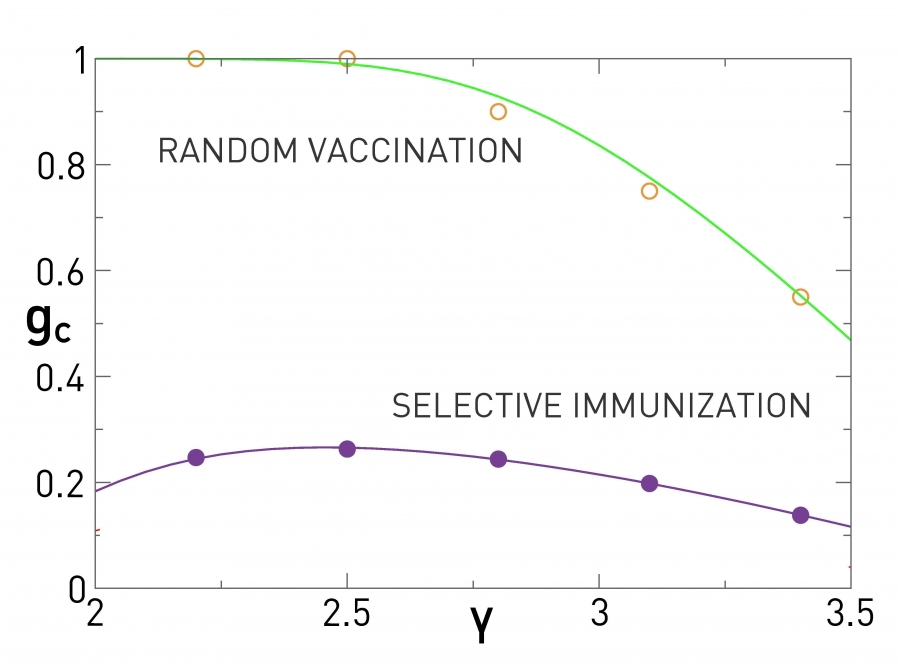]
]

---

## Summary

- Epidemic as first example of dynamical process over network
- Role of eigenvalue property in understanding epidemic spread
- Role of degree distribution (specifically scale) in understanding spread
- Role of high-degree nodes in robustness of networks to epidemics (immunization)

