class: title-slide, center, middle
count: false

.banner[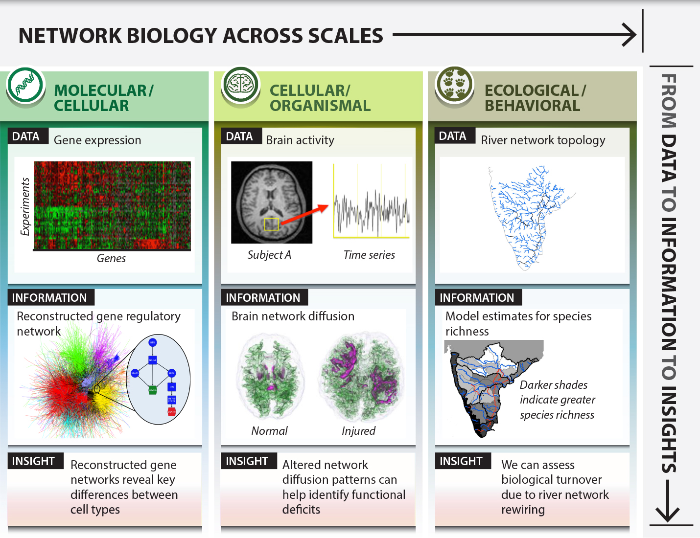]

.title[Random Networks]

.author[Héctor Corrada Bravo]

.other-info[
University of Maryland, College Park, USA  
CMSC828O `r Sys.Date()`
]

.logo[]

---
class: split-50
exclude: true

## What does my group do?

.column[
Study the **molecular** basis of *variation* in development and disease


Using **high-throughput** experimental methods  
]

.column[.image-80[]]

---

## The core of data analysis

Given observations (entities), and their characteristics (attributes)

Understand how those characteristics are _distributed_ in the population

- means, variances, empirical distributions
- data generative models with parameters

Hope we can infer something useful about that population from the understanding of the distribution of characteristics

---

## Thinking of networks in terms of data analysis

One way of thinking about networks:

- Entities and their characteristics (nodes and their attributes)
- Interactions and their characteristics (edges and their attributes)

How is the _presence or absence of interactions_ distributed in the population?

---

## Presence/absence models

Consider the analysis of a binary attribute in the population.

E.g., is gene PTEN expressed in normal breast cells?

What is a model we tend to use? Suppose the gene is expressed in $p$ cells in the
population.

I take a sample of $N$ cells, measure how many express PTEN.

---

## Presence/absence models

If we do this sampling experiment many times, we expect to see Binomial distribution

$$Y \sim Bin(N,p)$$

```{r, echo=FALSE, fig.align="center", fig.height=4.5}
hist(rbinom(1000, 100, .2), xlab="Y", main="Bin(100,.2)")
```

---

## Presence/absence models

What is our expectation for $Y$?
Variance?

--

For very large $N$, same distribution is well approximated by $Y\sim\mathrm{Poisson}(\lambda=pN)$

---

## Presence/absence models

```{r, echo=FALSE, fig.align="center"}
hist(rpois(1000, 1000*.2), xlab="Y",main="Pois(1000*.2)")
```

---

## Presence/absence models

We can follow a similar idea to model presence/absence of an _interaction_ in the network

Given a network over $N$ entities (vertices)

What is the population of interest? All possible pairwise interactions

---

## Presence/absence models

Assumptions:

Fraction $p$ of interactions actually occur in the population

The observed edges is a _realization_ of random occurrences in measurement of those interactions

How can we model the number of edges in a network?

---

## Presence/absence models

$Y \sim Bin(N(N-1/2), p)$

```{r, echo=FALSE, fig.align="center", fig.height=5}
hist(rbinom(1000, 100*99/2, .2), main="Bin(100*99/2, .2)", xlab="Y")
```

---

## Presence/absence models

What if we ask this question _one node at a time_?

If proportion $p$ of interactions actually occur in the population, then 
what is the distribution of the number of interactions (edges) for a single node?

---

## Presence/absence models

$k_i \sim Bin(N-1,p)$

```{r, echo=FALSE, fig.align="center", fig.height=5}
hist(rbinom(100, 99, .2), main="Bin(99,.2)", xlab="Y")
```

---

## Important observations

Expected degree is $p(N-1)$. 

--

One reasonable estimate from data would be $<k>$ (average degree)

---
class: split-50

## Important observations

.column[
- Degrees concentrated around expectation
- Low degree and high degree nodes rare
]
.column[
```{r, echo=FALSE, fig.align="center", fig.height=4}
hist(rbinom(1000, 99, .2), main="Bin(99,.2)", xlab="Y")
```
]

---

## Important observations

Back to Poisson

$k_i \sim \mathrm{Pois(<k>)}$

$p_k=P(k_i=k)=e^{-<k>}\frac{<k>^k}{k!}$

---

## Important observations

.center[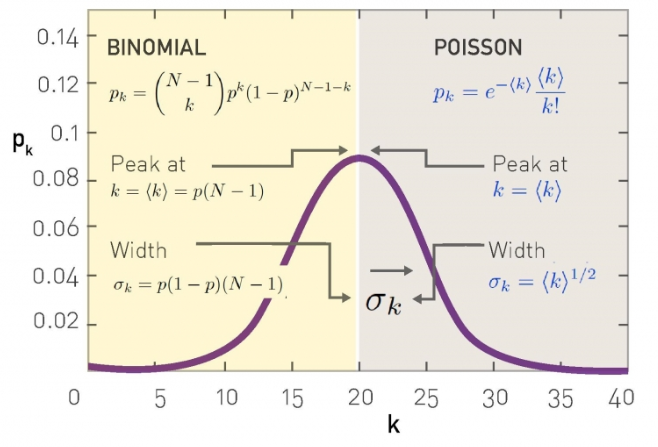]

Note: equation for $p_k$ is incorrect (numerator is $<k>^k$)

---

## ER network model

_Erdos-Renyi_ Construct a network with $N$ vertices given parameter $p$ by connecting vertices with probability $p$

---

## ER model

Emmergence of connected component

.center[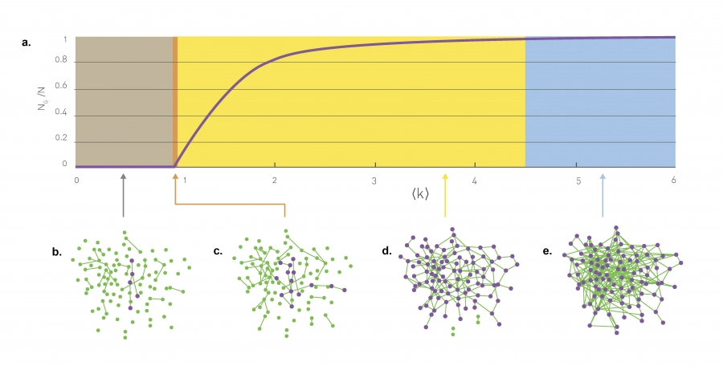]


---

## ER model

Small world

.center[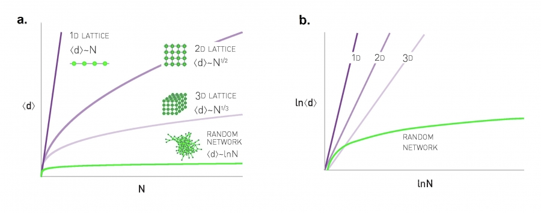]

---

## ER model

Clustering coefficient?

On the board

---

## ER model

How well does this model fit data?

.image-40.center[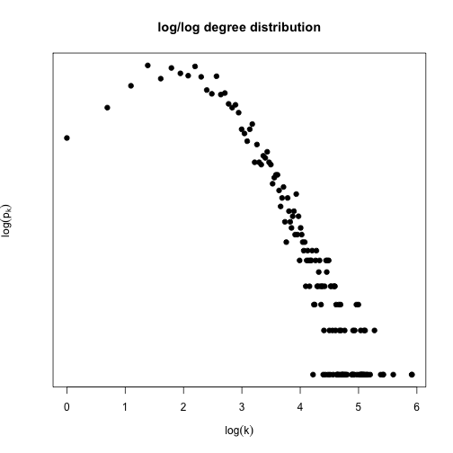]

---

## ER model

How well does this model fit data?

.center[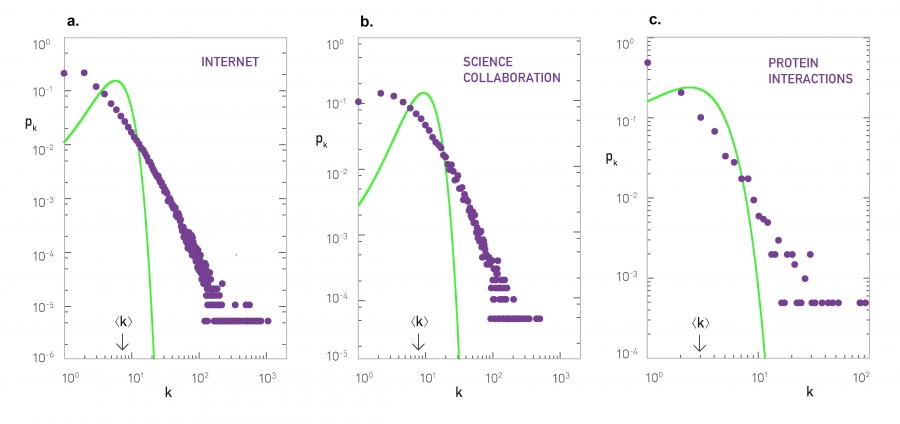]

---

## Power law

We see that exponential decay of high-degree probability does not fit data well.

Log-log plot suggests a linear relationship

$\log p_k \approx -\gamma \times \log k$

$p_k \approx k^{-\gamma}$

---

## Power law

.image-50[.center[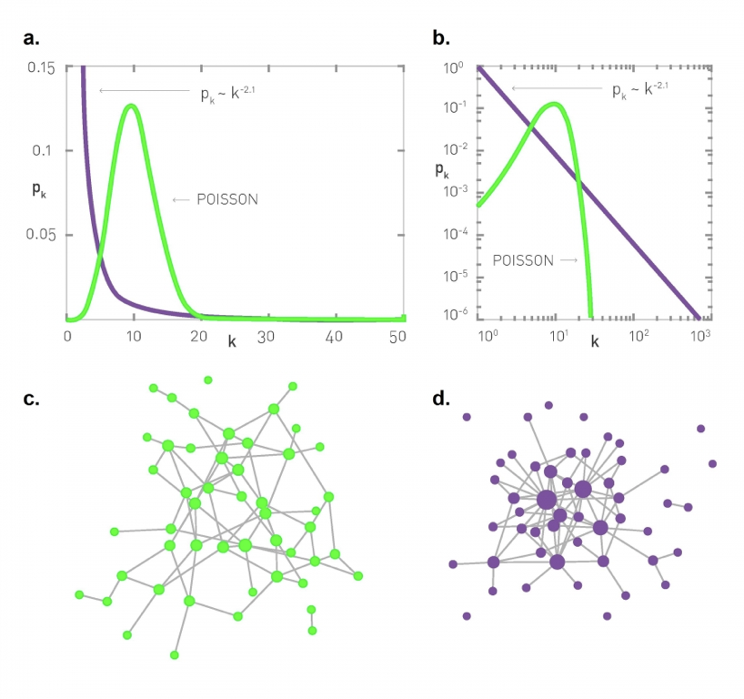]]

---

## Power law

.center[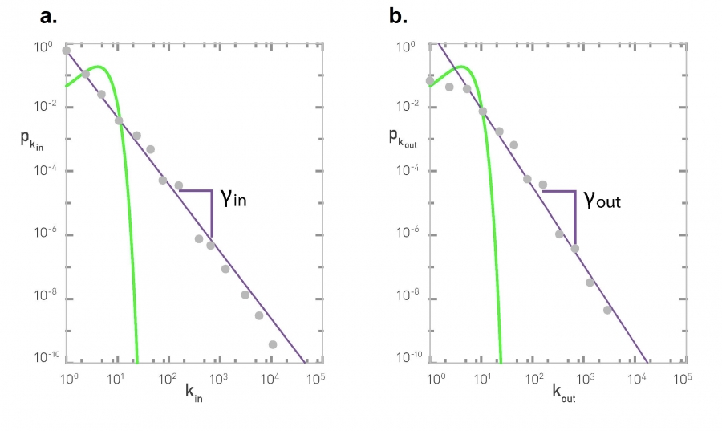]

---

## Power law (ultra-small world)

.image-50[.center[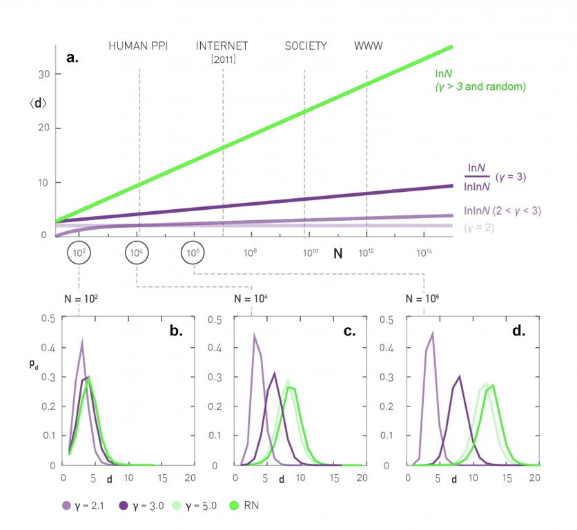]]

---

## Power law (scale-free)

.image-70[.center[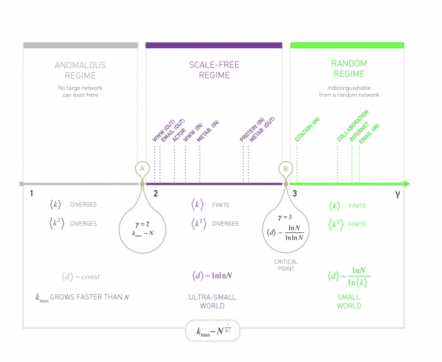]]

---

## Power Law

Generative random model for ER (poisson, random) network was straightforward

Next topics:
- Why scale-free?
- Fitting power law networks to data
- Generative random model for power law networks
- More sophisticated models to fit empirical data closer
- Biologically-plausible random models (evolution/fitness etc.)

---

## Power Law

Why scale-free? A couple of ways to think about it:

- The variance of the degree distribution is infinite
- The right-hand tail of the degree distribution does not go to 0

--

_Moments_ of an RV, the expected value of powers of an RV  
$E[k]$ - center of the distribution  
$E[k^2]$ - spread of the distribution (variance) **this is the important one**  
$E[k^3]$ - skew of the distribution  
and more...

---

## Power Law

Why scale-free?

$$E[k^2] = \sum_{k_{min}}^\infty k^2 p_k = \sum_{k_{min}}^\infty k^{2-\gamma}$$

--

Let's take some liberties to make this easier to think about

$$E[k^2] = \int_{k_{min}}^{k_{max}} k^{2-\gamma} dk$$

and see what happens as $k_{max} \to \infty$

---

## Power law

.center.image-80[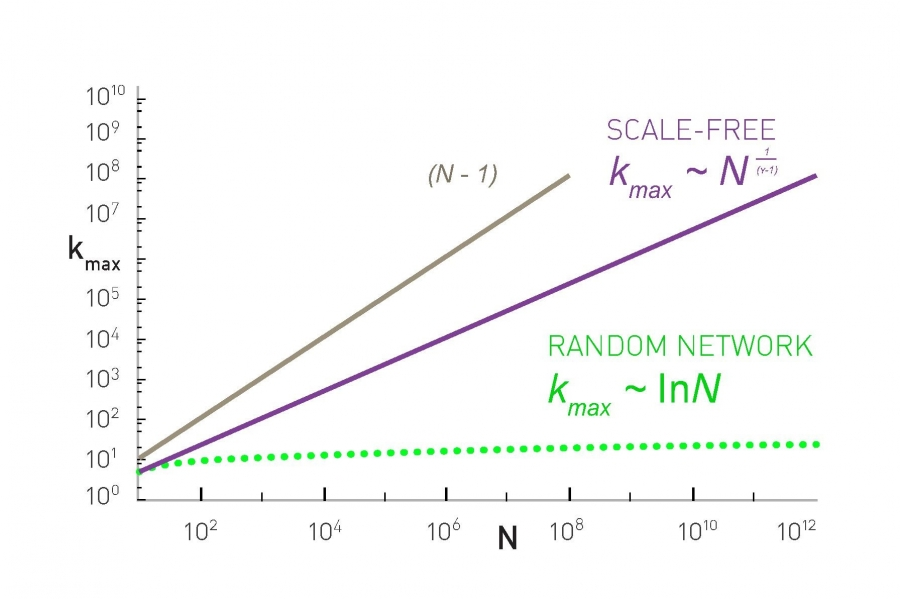]

---

## Power law

\begin{align}
E[k^2] & = & C\frac{k_{max}^{3-\gamma} - k_{min}^{3-\gamma}}{3-\gamma} \\
{} & = & a k_{max}^{3-\gamma} + b
\end{align}

- For $\gamma > 3$: scale is finite value as $k_{max}$ grows  
- For $2 \leq \gamma \leq 3$: scale is infinite value as $k_{\max}$ grows (scale-free)

---

## Power law

.image-70[.center[]]

---

## Estimating the degree coefficient

Since so many structural properties of network depend on this value, estimating it properly matters a lot.

Here is a procedure based on Maximum Likelihood Estimation

---

## Estimating the degree coefficient

.center.image-80[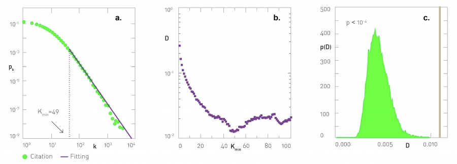]

---

## Estimating the degree coefficient

Step 1 - The estimate

Given $k_{min}$, estimate $\gamma$ as 

$$\gamma_{k_{min}} = 1 + N\left[ \sum_{i=1}^N \log \frac{k_i}{k_{min}-\frac{1}{2}} \right]^{-1}$$

---

## Estimating the degree coefficient

Step 2 - How good is it?

$$D_{k_{min}} = \max_{k \geq k_{min}} |S(k) - p_k|$$

with $p_k$ given by $\gamma_{k_{min}}$

---

## Estimating the degree coefficient

Step 3 - Best model fit

Estimate $\gamma$ as $\gamma_{k_{min}}$ that _minimizes_ $D_{k_{min}}$

---

## Estimating the degree coefficient

Step 4 - Model check

Is the optimal observed deviance $D_{k_{min}}$ consistent with the estimated $\gamma$?

Generate a distribution of deviance statistics from power law model, check where optimal deviance falls within generated distribution.

---

## Network Generation

The ER model gave use a generative algorithm to create a network that satisifies "Poisson" degree distribution?

Let's see a generative model to obtain a power law network

---

## The Barabasi-Albert Model

Procedure:

- Start with $m_0$ nodes (with arbitrary links, or connected)
- At each time step $t$
  - Growth: Add a new node with $m$ edges  
  - Preferential attachment: probability new node links to node $i$ $\Pi(k_i) = \frac{k_i}{\sum_i k_i}$
  
Some simple questions to warm up: (a) how many nodes after $t$ steps? (b) how many edges after $t$ steps?

---
class: split-50

## The Barabasi-Albert Model

.column[
Degree dynamics

$k_i(t) = m\left( \frac{t}{t_i} \right)^{1/2}$

]

.column[
.center.image-50[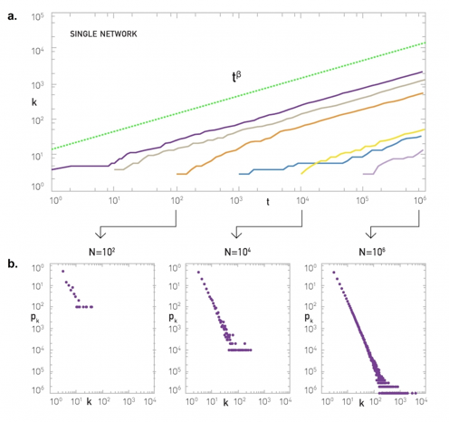]
]

---

## The Barabasi-Albert Model

.column[
Degree distribution

$p_k \sim k^{-3}$
]

.column[
.center.image-80[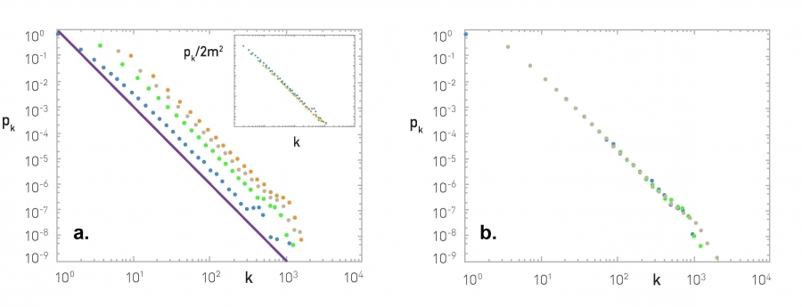]
]

---

## The Barabasi-Albert Model

.column[
Distance

$<d> = \frac{\log N}{\log \log N}$
]

.column[
.center.image-60[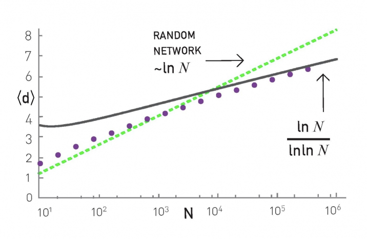]
]

---

## The Barabasi-Albert Model

Cluster coefficient

.center.image-70[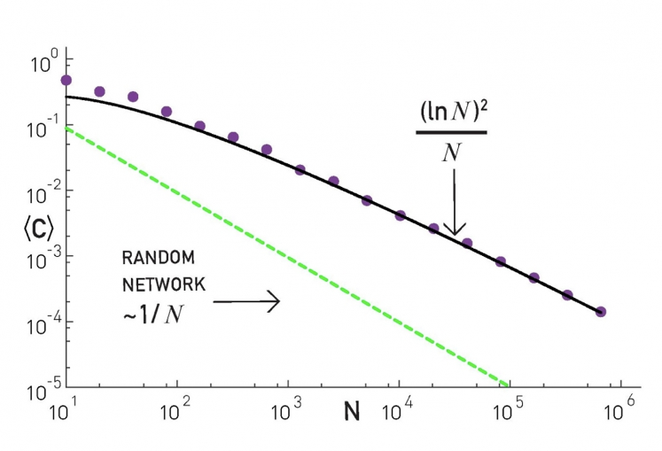]

---

## Network growth models

Barabasi-Albert, some missing ingredients

- Fitness, properties beyond degree that control preferential attachment
- Age, preferential attachment depending on time
- Death, how to model nodes that go away?

---

## Network growth models

.center.image-40[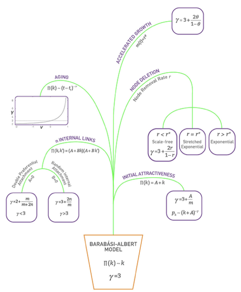]

---

## Network growth models

More importantly: how well does this describe biologically plausible emergence.

Is this consistent with evolution?

Next time...


