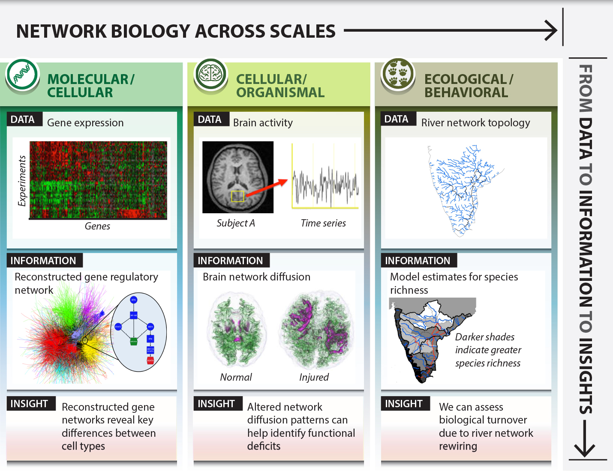

class: title-slide, center, middle
count: false

.banner[]

.title[Network Preliminaries]

.author[Héctor Corrada Bravo]

.other-info[
University of Maryland, College Park, USA  
CMSC828O `r Sys.Date()`
]

.logo[]

---
class: split-50
exclude: true

## What does my group do?

.column[
Study the **molecular** basis of *variation* in development and disease


Using **high-throughput** experimental methods  
]

.column[.image-80[]]

---
class: split-50

## Genetic Interaction Network

.column[
- Yeast high-throuput double-knockdown assay
- ~5000 genes
- ~800k interactions

http://www.geneticinteractions.org/
]

.column[.image-90[]]
.source[Costanzo et al. (2016) Science. DOI: 10.1126/science.aaf1420]  

---
class: split-50

## Genetic Interaction Network

.column[
- Yeast high-throuput double-knockdown assay
- ~5000 genes
- ~800k interactions

http://www.geneticinteractions.org/
]

.column[.image-70[]]
.source[Costanzo et al. (2016) Science. DOI: 10.1126/science.aaf1420]  


```{r libsetup, echo=FALSE, message=FALSE, warning=FALSE}
library(readr)
library(dplyr)
library(tidyverse)
```

```{r read_data, cache=TRUE, echo=FALSE, message=FALSE}
mat <- read_tsv("data/Data File S2. Raw genetic interaction datasets: Matrix format/SGA_NxN_clustered.cdt")
```

```{r setup_data, cache=TRUE, echo=FALSE, message=FALSE}
amat <- mat %>%
  slice(-(1:5)) %>%
  select(starts_with("dma")) %>%
  type_convert() %>%
  as.matrix()
amat <- 1 * (abs(amat) > 0.2)

coldata <- mat %>%
  slice(1:5) %>%
  select(GID, starts_with("dma")) %>%
  slice(2) %>% select(-1) %>%
  gather(dma, orf, starts_with("dma"))
  

row_orf <- mat %>%
  slice(-(1:5)) %>%
  pull(ORF)

m <- match(row_orf, coldata$orf)
rows_to_use <- !is.na(m)
cols_to_use <- m[rows_to_use]

amat <- amat[rows_to_use, cols_to_use]

rownames(amat) <- row_orf[rows_to_use]
colnames(amat) <- coldata$orf[cols_to_use]
diag(amat) <- 0
amat[is.na(amat)] <- 0
amat <- ceiling(0.5 * (amat + t(amat)))

num_vertices <- nrow(amat)
num_edges <- sum(amat)
degrees <- rowSums(amat)
ave_degree <- 2 * num_edges / num_vertices
density <- ave_degree / (num_vertices - 1)
```

```{r writeamat, echo=FALSE, cache=TRUE}
amat %>%
  as_data_frame() %>%
  write_csv(path="data/genetic_interaction_amat.csv")
```

---

## Genetic Interaction Network

- Number of vertices: `r num_vertices`  
- Number of edges: `r format(num_edges, big.mark=",")`

---
layout: true

## Preliminaries

---
class: split-40

.column[
**Network**: abstraction of _entities_ and their interactions  
**Graph**: mathematical representation

_vertices_: nodes  
_edges_: links
]

.column[

```{r toygraph, echo=FALSE, message=FALSE}
library(tidygraph)
library(ggraph)

graph <- as_tbl_graph(highschool)

graph_1958 <- graph %>%
  activate(edges) %>%
  filter(year == 1958)

undirected_graph_1958 <- graph_1958 %>%
  convert(to_undirected) %>%
  convert(to_simple)
```

```{r plot_undirected, echo=FALSE, fig.width=6}
undirected_graph_1958 %>%
  ggraph(layout="kk") +
    geom_edge_fan() +
    geom_node_point(size=3) +
    theme_graph(foreground=NA) +
    ggtitle("Undirected graph")
```
]

---
class: split-40

.column[
**Network**: abstraction of _entities_ and their interactions  
**Graph**: mathematical representation

_vertices_: nodes  
_edges_: links
]

.column[

```{r toygraph2, echo=FALSE, message=FALSE, fig.width=6}
graph_1958 %>%
  ggraph(layout="kk") +
    geom_edge_fan(arrow=arrow(length=unit(0.15,"inches"))) +
    geom_node_point(size=3) +
    theme_graph(foreground=NA) +
    ggtitle("Directed graph")
```
]

---
layout: true

## Network statistics: notation

---

Number of vertices: $n$

In our example: _number of genes_

--

Number of edges: $m$

In our example: _number of genetic interactions_

--

Degree of vertex $i$: $k_i$

_Number of genetic interactions for gene $i$_

---

On the board:

- Calculate number of edges $m$ using degrees $k_i$
  (for both directed and undirected networks)
  
- Calculate _average degree_ $c$
- Calculate _density_ $\rho$

--

In our example:

Average degree: `r ave_degree`  
Density: `r density`

---
layout: true

## (On the board)

---


Number of edges using degrees (undirected)

$$
m = \frac{1}{2} \sum_{i=1}^n k_i
$$

Number of edges using degrees (directed)

$$m = \sum_{i=1}^n k_i^{\textrm{in}} = \sum_{i=1}^n k_i^{\textrm{out}}$$

---

Average degree

$$c = \frac{1}{n} \sum_{i=1}^n k_i$$

Density

$$\rho=\frac{m}{\binom{n}{2}} = \frac{2m}{n(n-1)} = \frac{c}{n-1} \approx \frac{c}{n}$$

---
layout: false
class: split-50

## Degree distribution

.column[
Fundamental analytical tool to characterize networks

$p_k$: probability randomly chosen vertex has degree $k$

On the board: how to calculate $p_k$ and how to calculate average
degree $c$ using degree distribution.
]

.column[
```{r stats, echo=FALSE, cache=TRUE}
degree_count <- table(degrees)
degree_dist <- degree_count / num_vertices
```

```{r plot_deg, echo=FALSE, fig.width=5}
hist(degrees, nc=50, main="Degree Distribution",xlab="Degree")
```
]

---

## (On the board)

Degree distribution

$$p_k = \frac{n_k}{n}$$

$n_k$: number of nodes in graph with degree $k$

---

## Degree Distribution

```{r plot_loglog, echo=FALSE, fig.align="center"}
degs <- as.integer(names(degree_count))
plot(log(degs), log(degree_dist), pch=19,
     main="log/log degree distribution",
     xlab=expression(log(k)), ylab=expression(log(p[k])))
```

---
class: split-40

## Paths and Distances

.column[
_Distance_ $d_{ij}$: length of **shortest** path betwen vertices $i$ and $j$.
]

.column[
```{r toy3, echo=FALSE, fig.width=6}
undirected_plot_1958 <- undirected_graph_1958 %>%
  ggraph(layout="kk") +
    geom_edge_fan() +
    geom_node_point(size=3) +
    theme_graph(foreground=NA)
undirected_plot_1958
```
]
---
class: split-40

## Paths and Distances

.column[
_Distance_ $d_{ij}$: length of **shortest** path betwen vertices $i$ and $j$.

_Diameter_: longest shortest path $\max_{ij} d_{ij}$
]

.column[
```{r toy4, echo=FALSE, fig.width=6}
undirected_plot_1958
```
]

---
class: split-40

## Paths and Distances

.column[
_Distance_ $d_{ij}$: length of **shortest** path betwen vertices $i$ and $j$.

On the board: average path length
]

.column[
```{r toy5, echo=FALSE, fig.width=6}
undirected_plot_1958
```
]

---

## (On the board)

Average path length

$$\overline{d}=\frac{1}{n(n-1)} \sum_{i,j;i\neq j} d_{ij}$$

---

## Distance Distribution

```{r floyd_warshal, cache=TRUE, echo=FALSE, results="hide"}
fw_dists <- function(amat) {
  nvertices <- nrow(amat)
  dmat <- matrix(Inf, nvertices, nvertices)
  diag(dmat) <- 0
  dmat[amat == 1] <- 1
  
  for (k in seq_len(nvertices)) {
#    cat(".")
    dk <- outer(dmat[,k],dmat[k,],FUN="+")
    switch <- dmat > dk
    dmat[switch] <- dk[switch]
  }
#  cat("\n")
  dmat
}

dmat <- fw_dists(amat)
```

```{r dmat_dist, echo=FALSE, eval=TRUE}
dist_tab <- tibble(dist=dmat[upper.tri(dmat, diag=FALSE)]) %>%
  group_by(dist) %>%
  summarize(freq=n()) %>%
  mutate(pdist=freq / sum(freq))
```

```{r plot_dist, echo=FALSE, eval=TRUE, fig.align="center"}
dist_tab %>%
  ggplot(aes(dist, log(pdist))) +
    geom_point(size=2.7) +
    scale_x_continuous(breaks=seq(0,20,2))
```

---

# Distances and paths

By convention: if there is no path between vertices $i$ and $j$ then $d_{ij}=\infty$

--

_Vertices_ $i$ and $j$ are _connected_ if $d_{ij} < \infty$

--

_Graph_ is connected if $d_{ij} < \infty$ for all $i$, $j$

--

_Components_ maximal subset of connected components

---

# Components

```{r disconnected, echo=FALSE, fig.align="center"}
graph %>%
  activate(edges) %>%
  filter(year == 1957) %>%
  convert(to_undirected) %>%
  convert(to_simple) %>%
  ggraph(layout="kk") +
    geom_edge_fan() +
    geom_node_point(size=3) +
    theme_graph(foreground=NA) 
```

---

# Clustering Coefficient

One more quantity of interest: how dense is the neighborhood around vertex $i$?

Do the genes that interact with me also interact with each other?

Definition on the board

---

## (On the board)

Clustering coefficient

$$c_i = \frac{2m_i}{k_i(k_i-1)}$$

$m_i$: number of edges between neighbors of vertex $i$


---

# Clustering coefficient

```{r clust_coef, cache=TRUE, echo=FALSE, fig.align=TRUE}
cc <- vector("numeric", num_vertices)

for (i in seq_len(num_vertices)) {
  ki <- degrees[i]
  denom <- ki * (ki-1) / 2
  neighbors <- which(amat[,i] > 0)
  mi <- sum(amat[neighbors, neighbors]) / 2
  cc[i] <- mi / denom
}

cc_dat <- data_frame(degree=degrees, cc=cc) %>%
  group_by(degree) %>%
  summarize(ck=mean(cc))
```

```{r cc_plot, echo=FALSE, fig.align="center"}
cc_dat %>%
  filter(degree>1) %>%
  ggplot(aes(degree, ck)) +
    geom_point(na.rm=TRUE) +
    scale_x_log10(
      breaks = scales::trans_breaks("log10", function(x) 10^x),
      labels = scales::trans_format("log10", scales::math_format(10^.x))) +
    scale_y_log10(
      breaks = scales::trans_breaks("log10", function(x) 10^x),
      labels = scales::trans_format("log10", scales::math_format(10^.x)))
```

---
class: split-50

# Adjacency Matrix

.column[
```{r toy6, echo=FALSE, fig.width=6,eval=FALSE}
undirected_graph <- graph %>%
  activate(edges) %>%
  filter(year == 1958) %>%
  mutate(single_edge = !edge_is_mutual() & !edge_is_multiple()) %>%
  filter(single_edge) %>% 
  activate(nodes) %>%
  mutate(connected = !node_is_isolated()) %>%
  filter(connected) 

undirected_graph %>%
  ggraph(layout="kk") +
    geom_edge_fan() +
    geom_node_point(size=3) +
    theme_graph(foreground=NA) +
    ggtitle("Undirected graph")
```

```{r toy61, echo=FALSE, fig.width=6}
undirected_plot_1958 +
  ggtitle("Undirected graph")
```
]

.column[
```{r adjplot2, echo=FALSE, fig.align="center", fig.width=5,warning=FALSE}
undirected_amat_plot_1958 <- undirected_graph_1958 %>%
  igraph::as_adj() %>%
  as.matrix() %>%
  as_data_frame() %>%
  rowid_to_column(var="row") %>%
  gather("column", "edge", -row) %>%
  mutate(column=as.integer(column)) %>%
  mutate(edge=as.integer(edge)) %>%
  ggplot(aes(x=row,y=column,fill=factor(edge))) +
    geom_raster() +
    scale_fill_manual(values=c("white","black")) +
    theme(axis.text=element_blank(),
          axis.title=element_blank(),
          axis.ticks=element_blank(),
          legend.position="none")
undirected_amat_plot_1958
```
]

---
class: split-50

# Adjacency Matrix

.column[
On the board:
  - Definition
  - Computing degree with adj. matrix
  - Computing num. edges $m$ with adj. matrix
  - Computing paths with adj. matrix
]

.column[
```{r adjplot3, echo=FALSE, fig.align="center", fig.width=5, warning=FALSE}
undirected_amat_plot_1958
```
]
---
class: split-50

# Adjacency Matrix

.column[
```{r toy8, echo=FALSE, fig.width=6,eval=TRUE}
graph_1958 %>%
  ggraph(layout="kk") +
    geom_edge_fan(arrow=arrow(length=unit(0.15,"inches"))) +
    geom_node_point(size=3) +
    theme_graph(foreground=NA) +
    ggtitle("Directed graph")
```
]

.column[
```{r adjplot4, echo=FALSE, fig.align="center", fig.width=5,eval=TRUE, warning=FALSE}
graph_1958 %>% 
  igraph::as_adj() %>%
  as.matrix() %>%
  as_data_frame() %>%
  rowid_to_column(var="row") %>%
  gather("column", "edge", -row) %>%
  mutate(column=as.integer(column)) %>%
  mutate(edge=as.integer(edge)) %>%
  ggplot(aes(x=row,y=column,fill=factor(edge))) +
    geom_raster() +
    scale_fill_manual(values=c("white","black")) +
    theme(axis.text=element_blank(),
          axis.title=element_blank(),
          axis.ticks=element_blank(),
          legend.position="none")
```
]

---
layout: true

---

## Weighted networks

Edges are assigned a weight indicating quantitative property of interaction

--

- Strength of genetic interaction (evidence from experiment)

- Rates in a metabolic network

- Spatial distance in an ecological network

---

Adjacency matrix contains weights instead of 0/1 entries

--

Path lengths are the sum of edge weights in a path

---

## Hypergraphs

Edges connect more than two vertices


.source[https://journals.plos.org/ploscompbiol/article?id=10.1371/journal.pcbi.1000385]

---
class: split-50

## Trees

.column[
_Acyclic graphs_

Single path between any pair of vertices
]

.column[

]

.source[https://www.sciencedirect.com/science/article/pii/S0981942817304321]

---

## Bipartite Networks


.center.middle.image-70[]

.source[https://journals.plos.org/ploscompbiol/article?id=10.1371/journal.pcbi.1000385]

---

## Bipartite Networks

We use an _Incidence Matrix_ $B$ instead of _Adjacency Matrix_

(On the board): definition

---

## Bipartite Networks

### Projections

_vertex projection_: $P_{ij}$, num. of groups in which vertices $i$ and $j$ co-occur

_group projection_: $P'_{ij}$, num. of members groups $i$ and $j$ share

--

(On the board)

$$P=B^TB$$

$$P'=BB^T$$

---
class: split-40

## Centrality


.column[
What are the _important_ nodes in the network? 

What are _central_ nodes in the network?
]

.column[
```{r centrality, echo=FALSE, fig.width=8,eval=TRUE}
undirected_graph_1958 %>%
  activate(nodes) %>% 
  mutate(centrality = centrality_eigen()) %>%
  ggraph(layout="kk") +
    geom_edge_fan() +
    geom_node_point(aes(size=centrality)) +
    theme_graph(foreground=NA)
```
]

---

## Centrality

### Undirected Graphs
- Eigenvalue Centrality

### Directed Graphs
- Katz Centrality
- Pagerank

---
class:split-50

## Centrality

.column[
```{r deg_centrality, fig.width=6, echo=FALSE,eval=TRUE}
undirected_graph_1958 %>%
  activate(nodes) %>% 
  mutate(degree_centrality = centrality_degree()) %>%
  ggraph(layout="kk") +
    geom_edge_fan() +
    geom_node_point(aes(size=degree_centrality)) +
    theme_graph(foreground=NA)
```
]

.column[
```{r eig_centrality, fig.width=6, echo=FALSE,eval=TRUE}
undirected_graph_1958 %>%
  activate(nodes) %>% 
  mutate(eigen_centrality = centrality_eigen()) %>%
  ggraph(layout="kk") +
    geom_edge_fan() +
    geom_node_point(aes(size=eigen_centrality)) +
    theme_graph(foreground=NA)
```
]

---
layout: true

## Betweenness

---
class: split-40

.column[
What are the _important_ edges in the network? 

What are edges that may connect clusters of nodes in the network?
]

.column[
```{r betweenness, echo=FALSE, fig.width=6,eval=TRUE}
undirected_graph_1958 %>%
  activate(edges) %>% 
  mutate(betweenness = centrality_edge_betweenness()) %>%
  ggraph(layout="kk") +
    geom_edge_fan(aes(width=betweenness)) +
    scale_edge_width_continuous(range=c(0,2)) +
    geom_node_point(size=3) +
    theme_graph(foreground=NA)
```
]

---
class: split-40

.column[
Girvan-Newman Algorithm - hierarchical method to
partition nodes into communities using edge betweenness
]

.column[
```{r gn, echo=FALSE, fig.width=6, eval=TRUE}
undirected_graph_1958 %>%
  activate(edges) %>%
  mutate(betweenness=centrality_edge_betweenness()) %>%
  activate(nodes) %>%
  mutate(group = factor(group_edge_betweenness())) %>%
  ggraph(layout="kk") +
    geom_edge_fan(aes(width=betweenness)) +
    scale_edge_width_continuous(range=c(0,2)) +
    geom_node_point(aes(color=group), size=3) +
    theme_graph(foreground=NA)
```
]

---
layout: true

## Girvan-Newman Algorithm

---

Two phases:

  Phase One: Compute betweenness for every edge  
  Phase Two: Discover communities by removing _high_ betweenness edges (similar to hierarchical clustering)

---

### Calculating Betweenness

Formally, $\mathrm{betweenness}(e)$: fraction of vertex pairs $(x,y)$ where shortest path crossess edge $e$

Path Counting: For each vertex $x$, use breadth-first-search to count number of shortest paths through each edge $e$ in graph between $x$ and every other vertex $y$.

Sum result across vertices for each edge $e$, and divide by two

Presentation from _Mining Massive Datasets_ Leskovec, et al. http://mmds.org/ (Ch. 10)

---

### Counting Paths

Algorithm (starting from node $x$)

1. Construct breadth-first search tree
2. (Root->Leaf) Label each vertex $v$ with the number of shortest paths between $x$ and $v$: sum of labels of parents 
3. (Leaf->Root) Count the (weighted) number of shortest paths that go through each edge: next slide

---

### Counting Paths

Step 3, counting number of shortest paths through each edge

a. Leafs $v$ in search tree get a _credit_ of $C_v=1$

b. Incoming edge $e_i=(y_i,v)$ to vertex $v$ in search tree gets _credit_ $C_{e_i}=C_v * \frac{p_i}{\sum_j p_j}$ 
  - $p_i$: number of shortest paths between $x$ and $y_i$ (computed in Step 2)
  - sum $\sum_j$ is over parents of $v$ 

---

### Counting Paths

c. Non-leaf vertex $v$ gets credit $C_v = 1 + \sum_j e_j$ where sum $j$ is over outgoing edges $e_j$ in search tree

---

### Example


---
layout: true

## Resources

---

### Cross-language

igraph: http://igraph.org/  
Boost Graph Library: https://www.boost.org/doc/libs/1_71_0/libs/graph/doc/

---

### Python

- [`igraph`](http://igraph.org/python/doc/tutorial/tutorial.html)
- [`networkx`](https://networkx.github.io/)

---

### R

Workhorses: 
- [`igraph`](https://cran.r-project.org/web/packages/igraph/index.html)
- [`Rgraphviz`](https://www.bioconductor.org/packages/release/bioc/html/Rgraphviz.html)

Tidyverse (https://tidyverse.org):
- [`tidygraph`](https://cran.r-project.org/web/packages/tidygraph/index.html)
- [`ggraph`](https://cran.r-project.org/web/packages/ggraph/index.html)

---
class: split-50

For data analysis it is helpful to think in terms of rectangular datasets

For networks, we need to have two distinct
tables to represent this data. 

- One table represents entities and their attributes:

.column[
```r 
 undirected_graph_1958 %>%
  activate(nodes) %>%
  as_tibble()
```
]

.column[
```{r graph_nodes, echo=FALSE}
 undirected_graph_1958 %>%
  activate(nodes) %>%
  as_tibble()
```
]

---
class: split-50

- Second table to represent edges and their attributes:

.column[
```r
undirected_graph_1958 %>%
  activate(edges) %>%
  as_tibble()
```
]

.column[
```{r graph_edges, echo=FALSE}
undirected_graph_1958 %>%
  activate(edges) %>%
  as_tibble()
```
]

---
layout: true

## Network-derived attributes

---

Besides attributes measured for each node, we have seen we can derive 
node and edge attributes based on the structure of the network.

For instance, we can compute the _degree_ of a node, that is, the number of edges incident to the node. 

---
class: split-50

.column[
```r
undirected_graph_1958 <- undirected_graph_1958 %>%
  activate(nodes) %>%
  mutate(degree = centrality_degree())

undirected_graph_1958 %>%
  activate(nodes) %>%
  as_tibble
```
]

.column[
```{r node_add_degree, echo=FALSE}
undirected_graph_1958 <- undirected_graph_1958 %>%
  activate(nodes) %>%
  mutate(degree = centrality_degree())

undirected_graph_1958 %>%
  activate(nodes) %>%
  as_tibble
```
]
---
class: split-50

The distribution of newly created attributes are fundamental analytical tools to characterize networks.

.column[
```r
undirected_graph_1958 %>%
  activate(nodes) %>%
  as_tibble() %>%
  group_by(degree) %>%
  summarize(n=n()) %>%
  ungroup() %>%
  mutate(num_nodes = sum(n)) %>%
  mutate(deg_prop = n / num_nodes) %>%
  ggplot(aes(x=log(degree), y=log(deg_prop))) +
    geom_point() +
    labs(title="Degree distribution of transaction network",
         x="Degree (log)",
         y="Proportion of nodes (log)")
```
]

.column[
```{r plot_deg2, echo=FALSE, eval=TRUE,fig.align='center',fig.width=6, fig.height=5}
undirected_graph_1958 %>%
  activate(nodes) %>%
  as_tibble() %>%
  group_by(degree) %>%
  summarize(n=n()) %>%
  ungroup() %>%
  mutate(num_nodes = sum(n)) %>%
  mutate(deg_prop = n / num_nodes) %>%
  ggplot(aes(x=log(degree), y=log(deg_prop))) +
    geom_point() +
    labs(title="Degree distribution of friendship network",
         x="Degree (log)",
         y="Proportion of nodes (log)")
```
]