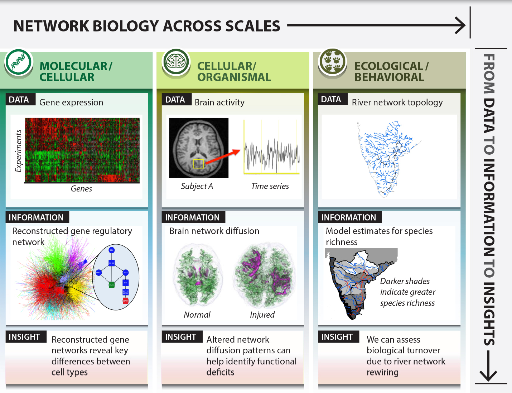

class: title-slide, center, middle
count: false

.banner[]

.title[Statistical Analysis of Network Data]

.author[Héctor Corrada Bravo]

.other-info[
University of Maryland, College Park, USA  
CMSC828O `r Sys.Date()`
]

.logo[]

---
class: split-50
exclude: true

## What does my group do?

.column[
Study the **molecular** basis of *variation* in development and disease

Using **high-throughput** experimental methods  
]

.column[.image-80[]]

---

## Statistical Analysis

In this next unit we will look at methods that approach network analysis from a statistical inference perspective. 

In particular we will look at two general notions

- Analyzing edges between vertices as a stochastic process over which we can make statistical inferences

- Analyzing a process (e.g., diffusion) over a network in a statistical manner

---

## Statistical Analysis

Let' start with an example

I NEED DATA

---
layout: true

## Exponential Random Graph Models

---

Extension to random graph models we saw in previous section

Previously edge probabilities were (more or less) independent of vertex characterisitics.

Assume vertices have measured attributes, what is the effect of these attributes in network formation. Specifically in edge occurence.

---

THE MODEL

---

THE INFERENCE

---

AN EXAMPLE

---

GOODNESS OF FIT

---
layout: true

## Stochastic Block Models

---

Clustering vertices

Edge probability depends on class/cluster membership of vertices

---

MODEL

---

INFERENCE

---

EXAMPLE

---

GOODNESS OF FIT

---
layout: true

## Latent Network Models

---

Extension to include attributes.

Drawn from SNA literature to model homophily

---

MODEL

---

INFERENCE

---

EXAMPLE

---

GOODNESS OF FIT (do we even have it?)

---
layout: true

## Communities

---

These last two models are related to community finding methods that are not statistical.

E.g., Newman-Girvan

---

NEWMAN-GIRVAN algorithm

---

COMPARISON TO LATENT AND SBM MODELS

Cite the Bickel paper:
http://www.pnas.org/content/106/50/21068.full

