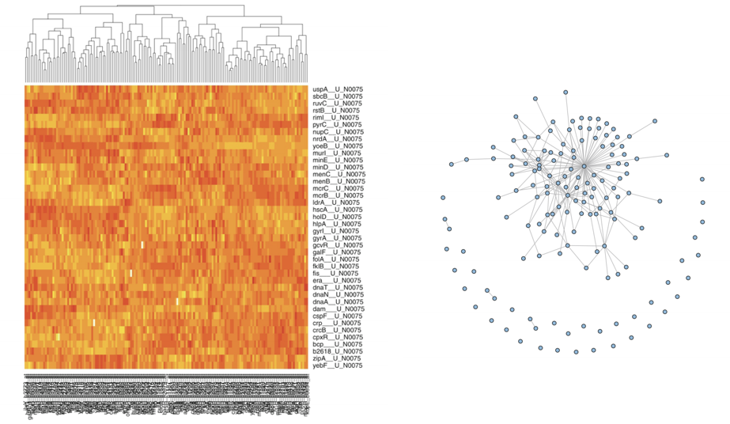
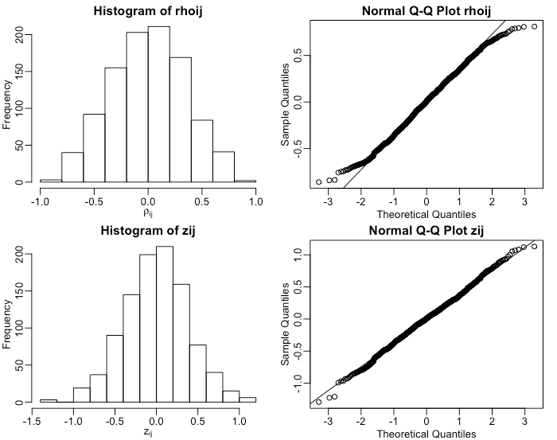

```{r setup, echo=FALSE}
knitr::opts_chunk$set(warning=FALSE, message=FALSE, cache=TRUE)
```

class: title-slide, center, middle
count: false

.banner[]

.title[Statistical Analysis of Network Data]

.author[Héctor Corrada Bravo]

.other-info[
University of Maryland, College Park, USA  
CMSC828O `r Sys.Date()`
]

.logo[]

---
class: split-50
exclude: true

## What does my group do?

.column[
Study the **molecular** basis of *variation* in development and disease


Using **high-throughput** experimental methods  
]

.column[.image-80[]]

---
layout: true

## Statistical Analysis

---

In this next unit we will look at methods that approach network analysis from a statistical inference perspective. 

---

In particular we will look at three statistical inference and learning tasks over networks

- Analyzing edges between vertices as a stochastic process over which we can make statistical inferences

- Constructing networks from observational data

- Analyzing a process (e.g., diffusion) over a network in a statistical manner

---
layout: false

## Spatial effects in ecological networks

.center.middle[]

.source[https://doi.org/10.1016/j.prevetmed.2014.01.013]

```{r, child='stat_inference.rmd'}
```

```{r, eval=FALSE, child='net_structure.rmd'}
```


---
layout: true

## Learning Network Structure
---

How to find network structure from observational data (e.g., gene expression)
  
.center.image-70[]

---

### Correlation Networks

The simplest approach: compute correlation between observations, if correlation high, add an edge

---

Assume data $y_i=\{y_{i1}, y_{i2}, \ldots, y_{iT}\}$ (e.g., gene expression of gene $i$ in $T$ different conditions) and $y_j$

Important quantity 1: the _covariance_ of $y_i$ and $y_j$

$$\sigma_{ij} = \frac{1}{T}\sum_{t=1}^T (y_{it}-\overline{y}_i)(y_{jt}-\overline{y}_j)$$


---

Important quantity 1: the _covariance_ of $y_i$ and $y_j$

$$\sigma_{ij} = \frac{1}{T} \sum_{t=1}^T (y_{it}-\overline{y}_i)(y_{jt}-\overline{y}_j)$$

How do $y_i$ and $y_j$ vary around their means?

---

We can estimate $\sigma_{ij}$ from data by plugging in the mean of $y_i$ and $y_j$. 

We would notate the estimate as $\hat{\sigma}_{ij}$. 

In the following, $\sigma_{ij}$ often means $\hat{\sigma}_{ij}$, it should follow from context.

---

We often need to compare quantities across different entities in system, e.g., genes, so we want to remove _scale_

_Pearson's Correlation_: 

$$\rho_{ij} = \frac{\sigma_{ij}}{\sigma_{ii}\sigma_{jj}}$$
With $\sigma_{ii}$ the standard deviation of $y_i$:

$$\sigma_{ii} = \sqrt{\frac{1}{T} \sum_{i=1}^T (y_{it}-\overline{y}_i)}$$

---

Note Pearson Correlation is between -1 and 1, it is hard to perform inference on bounded quantities, so one more transformation.

Fisher's transformation

$$z{ij} = \tanh^{-1}(\rho_{ij}) = \frac{1}{2}\log \frac{1+\rho_{ij}}{1-\rho_{ij}}$$

---
class: split-40

.column[
Edge inference: hypothesis test

$$H_0=\rho_{ij}=0 \; H_A=\rho_{ij} \neq 0$$

Compute $P$-value $p_{ij}$ from $N(0,\sqrt{1/(T-3)})$
]

.column.center.image-90[]

---

Perform hypothesis test for every _pair_ of entities, i.e., possible edge  $i~j$

We would compute $P$-value for each possible edge

When performing many independent tests, $P$-values no longer have our intended interpretation

---

### Multiple Hypothesis Testing

|     | Called Significant | Not Called Significant | Total |
|-----|--------------------|------------------------|-------|
| Null True | $V$ | $m_0-V$ | $m_0$ |
| Altern. True | $S$ | $m_1-S$ | $m_1$ |
| Total | $R$ | $m-R$ | $m$ |

Note: $m$ total tests

---

### Error rates

**Family-wise error rate** (FWER): the probability of at least one Type I error (false positive) $\mathrm{FWER}=\Pr(V\geq 1)$

We use Bonferroni procedure to control FWER. 

If testing at level $\alpha$ (e.g., $\alpha=0.05$), only include egdes for which $P$-value $p_{ij} \leq \alpha/m$

---

### Error rates

**False Discovery Rate** (FDR): rate that false discoveries occur $\mathrm{FDR}=\mathbf{E}(V/R; R>0)Pr(R>0)$

We use Benjamini-Hochberg procedure to control FDR. 

Construct list of edges at FDR level $\beta$ (e.g. $\beta=0.1$) if $p_{(k)} \leq \frac{k}{m} \beta$, where $p_{(k)}$ is the $p$-value for the $k$-th largest $p$-value.

Note: there are other more precise FDR controlling procedures (esp. $q$-values)

---

### The problem with Pearson's correlation

Consider the following networks, where absence of edge corresponds to true _conditional independence_ between vertices in graph

.image-80.center[]

In all three of these, Pearson's correlation test with $\rho_{ij}$ is likely statistically significant.

---

Let's extend the way we think about the situation. First consider covariance _matrix_ for $i$, $j$ and $k$

$$\Sigma = \left( \begin{matrix}
\sigma_{ii}^2 & \sigma_{ij} & \sigma_{ik} \\
\sigma_{ji} & \sigma_{jj}^2 & \sigma_{jk} \\
\sigma_{ki} & \sigma_{kj} & \sigma_{kk}^2 
\end{matrix} \right)$$

---

We can then think about the covariance of $i$ and $j$ _conditioned_ on $k$

$$\Sigma_{ij|k} = \left( \begin{matrix} 
\sigma_{ii}^2 & \sigma_{ij} \\
\sigma_{ji} & \sigma_{jj}^2
\end{matrix} \right) - \sigma_{kk}^{-2}
\left( \begin{matrix}
\sigma_{ik}^2 & \sigma_{ik}\sigma_{jk} \\
\sigma_{ik}\sigma_{jk} & \sigma_{jk}^2
\end{matrix} \right)$$

How do $y_i$ and $y_j$ co-vary around their _conditional_ means $E(y_i|y_k)$ and $E(y_j|y_k)$

---

### Partial correlation networks

This leads to the concept of partial correlation (which we can derive from the conditional covariance)

$$\rho_{ij|k} = \frac{\rho_{ij} - \rho_{ik}\rho_{jk}}{\sqrt{(1-\rho_{ik}^2)}\sqrt{(1-\rho_{jk}^2)}}$$


---

### Partial correlation networks

What's the test now? No edge if $i$ and $j$ are conditionally independent (there is some $k$ such that $\rho_{ij|k}=0$) 

Formally:
$$H_0: \; \rho_{ij|k} = 0 \textrm{ for some } k \in V_{\backslash \{i,j\}}$$
$$H_A: \; \rho_{ij|k} \neq 0 \textrm{ for all } k$$
---

### Partial correlation networks

To determine edge $i \sim j$ compute $P$-value $p_{ij}$ as 

$$p_{ij} = \max \{ p_{ij|k}: \; k \in V_{\backslash \{i,j\}} \}$$

where $p_{ij|k}$ is a $P$-value computed from (transformed) partial correlation $\rho_{ij|k}$

Use multiple testing correction as before

---

### Problems with partial correlation networks

For every edge, must compute partial correlation wrt. every other vertex

Compound hypothesis tests like the above are harder to control for multiple testing (i.e., correction mentioned above is not quite right)

The dependence structure they represent is unclear

---

Here we turn to a very powerful abstraction, thinking of graphs as a way of describing the _joint_ distribution of gene expression measurements (Probabilistic Graphical Models).

---
layout: true

## Graphical Models

---

Consider each _complete vector_ of expression measurements at each time $\mathbf{y}$

Suppose some _conditional independence_ properties hold for some variables in $\mathbf{y}$, 
  - Example: variable $y_2$ and $y_3$ are independent given _remaining_ variables in $\mathbf{y}$
  
---

We can encode these conditional independence properties in a graph.

.center[]

---

Hammersley-Clifford theorem: all probability distributions that satisfy conditional independence properties in a graph can be written as

$$P(\mathbf{y})=\frac{1}{Z}\exp \{ \sum_{c\in C} f_c(\mathbf{y}_c) \}$$

$C$ is the set of all _cliques_ in a graph, $c$ a specific clique and $\mathbf{y_c}$ the variables in the clique.

---

The probability distribution is determined by the choice of potential functions $f_c$. Example: 

1. $f_c(y_i) = -\frac{1}{2} \tau_{ii}y_i^2$  
2. $f_c(\{y_i,y_j\}) = -\frac{1}{2} \tau_{ij}y_iy_j$  
3. $f_c(\mathbf{y_c}) = 0$ for $|y_c| \geq 3$

---
layout: true

## Graphical Gaussian Models

---
class: split-50

Define matrix $\Sigma^{-1}$ as

.column[
1. $\Sigma_{ij}^{-1} = \tau_{ij}$ if there is an edge between $y_i$ and $y_j$  

2. $\Sigma_{ij}^{-1} = 0$ otherwise

$$\Sigma^{-1} = \left( \begin{matrix}
\tau_{11}^2 & \tau_{12} & 0 & \tau_{14} \\
\tau_{12} & \tau_{22}^2 & \tau_{23} & 0 \\
0 & \tau_{23} & \tau_{33}^2 & \tau_{34} \\
\tau_{14} & 0 & \tau_{34} & \tau_{44}^2
\end{matrix} \right)$$

]

.column[
.center[]
]
---

With this in place, we can say that $\mathbf{y}$ is distributed as _multivariate_ normal distribution $N(0,\Sigma)$.

**Connection to partial correlation:** We can think about distribution of $y_i$ and $y_j$ conditioned on the rest of the graph $V_{\backslash \{i,j\}}$ and the (partial) correlation of $y_i$ and $y_j$ under this distribution

$$\rho_{ij|V_{\backslash \{i,j\}}} = - \frac{\tau_{ij}}{\tau_{ii}\tau_{jj}}$$

---
layout: true

## Sparse Inverse Covariance

---

With this framework in place we can now think of network structure inference.

Main idea: given draws from multivariate distribution $\mathbf{y}$ (i.e., expression vector at each time point), 

Estimate a _sparse_ inverse correlation matrix, get graph from the pattern of 0's in the estimated matrix

.source[Banerjee, et al. ICML 2006, JMLR 2008, Friedman Biostatistics 2007]

---

Maximum Likelihood estimate of inverse covariance is given by solution to

$$\max_{X \succ 0} \log \det X - (SX)$$

$S$ is the estimated sample covariance matrix

$$S=\sum_{t=1}^T \mathbf{y_t}\mathbf{y_t}'$$

(Yuck)

---

We can induce zeros in the solution using a penalized likelihood estimate

$$\max_{X \succ 0} \log \det X - (SX) - \lambda \|X\|_1$$

where $$\|X\|_1 = \sum_{ij} X_{ij}$$

(Yuckier)

---
class: split-50

### Block-coordinate ascent

Solve by maximizing one column of matrix at a time (edges for each variable, e.g., $x_{12}$ below)

$$\min_{\beta} \frac{1}{2} \|X_{11}^{1/2}\beta - z\|^2 + \lambda \|\beta\|_1$$

with $z=W_{11}^{1/2}s_{12}$ and

.column[
$$X=\left( \begin{matrix} 
X_{11} & x_{12} \\
x_{12} & x_{22}
\end{matrix} \right)$$
]

.column[
$$S=\left( \begin{matrix} 
S_{11} & s_{12} \\
s_{12} & s_{22}
\end{matrix} \right)$$
]

---

### Block-coordinate ascent

Solve by maximizing one column of matrix at a time (edges for each variable, e.g., $x_{12}$ below)

$$\min_{\beta} \frac{1}{2} \|X_{11}^{1/2}\beta - z\|^2 + \lambda \|\beta\|_1$$

Solution is then $x_{12} = W_{11}\beta$

(This is l1-regularized least squares, easy to solve, not yucky at all)

---

### Block-coordinate ascent

Solve by maximizing one column of matrix at a time (edges for each variable, e.g., $x_{12}$ below)

$$\min_{\beta} \frac{1}{2} \|X_{11}^{1/2}\beta - z\|^2 + \lambda \|\beta\|_1$$

Iterate over columns of matrix until $\beta$ converges (or even better, until objective function converges)

---
layout: false

## Summary

Using Gaussian Graphical Model representation

- multivariate normal probability over a sparse graph
- take resulting graph as e.g., _gene network_

Use sparsity-inducing regularization (l1-norm)

Block-coordinate ascent method leads to l1-regularized regression at each step

- Can use efficient coordinate descent (soft-thresholding) to solve regression problem

