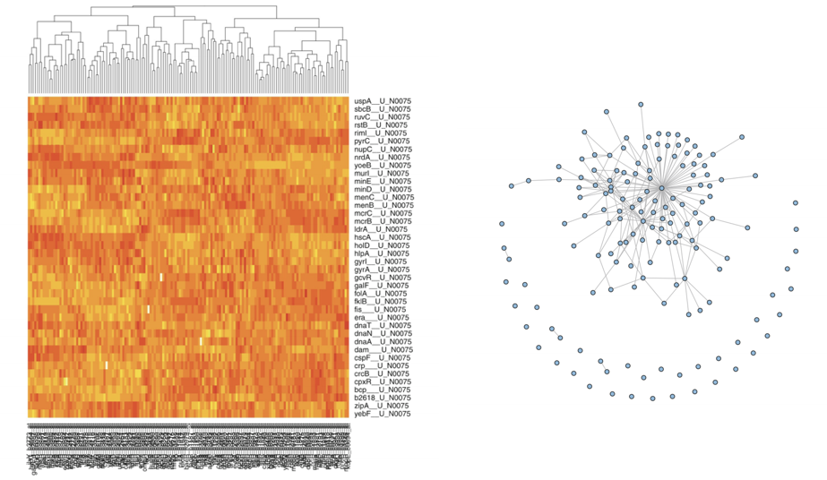
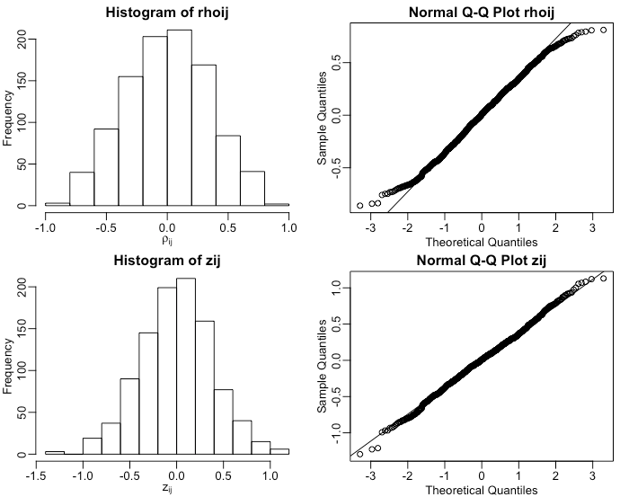

---
layout: true

## Learning Network Structure
---
  

How to find network structure from observational data (e.g., gene expression)

---

The simplest approach: compute correlation between observations, if correlation high, add an edge

ADD FIGURE HERE OF TWO TIME SERIES

---

Assume data $y_i=\{y_{i1}, y_{i2}, \ldots, y_{iT}\}$ (e.g., gene expression of gene $i$ in $T$ different conditions) and $y_j$

Important quantity 1: the _covariance_ of $y_i$ and $y_j$

$$\sigma_{ij} = \frac{1}{T}\sum_{t=1}^T (y_{it}-\overline{y}_i)(y_{jt}-\overline{y}_j)$$

---

Important quantity 1: the _covariance_ of $y_i$ and $y_j$

$$\sigma_{ij} = \frac{1}{T} \sum_{t=1}^T (y_{it}-\overline{y}_i)(y_{jt}-\overline{y}_j)$$

How do $y_i$ and $y_j$ vary around their means?

---

We can estimate $\sigma_{ij}$ from data by plugging in the mean of $y_i$ and $y_j$. 

We would notate the estimate as $\hat{\sigma}_{ij}$. 

In the following, $\sigma_{ij}$ often means $\hat{\sigma}_{ij}$, it should follow from context.

---

We often need to compare quantities across different entities in system, e.g., genes, so we want to remove _scale_

_Pearson's Correlation_: 

$$\rho_{ij} = \frac{\sigma_{ij}}{\sigma_i\sigma_j}$$
With $\sigma_i$ the standard deviation of $y_i$:

$$\sigma_i = \sqrt{\frac{1}{T} \sum_{i=1}^T (y_{iT}-\overline{y}_i)}$$

---

Note Pearson Correlation is between -1 and 1, it is hard to perform inference on bounded quantities, so one more transformation.

Fisher's transformation

$$z{ij} = \tanh^{-1}(\rho_{ij}) = \frac{1}{2}\log \frac{1+\rho_{ij}}{1-\rho_{ij}}$$

---

Edge inference: hypothesis test

$$H_0=\rho_{ij}=0 \; H_A=\rho_{ij} \neq 0$$

---
