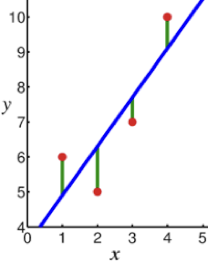
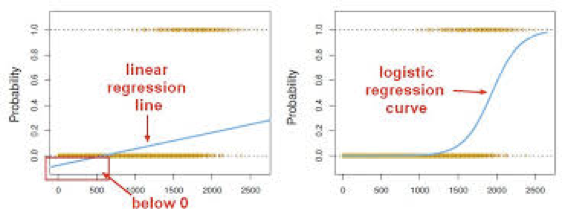
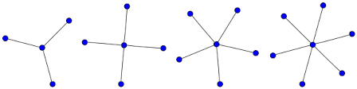
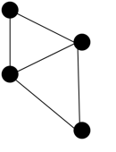
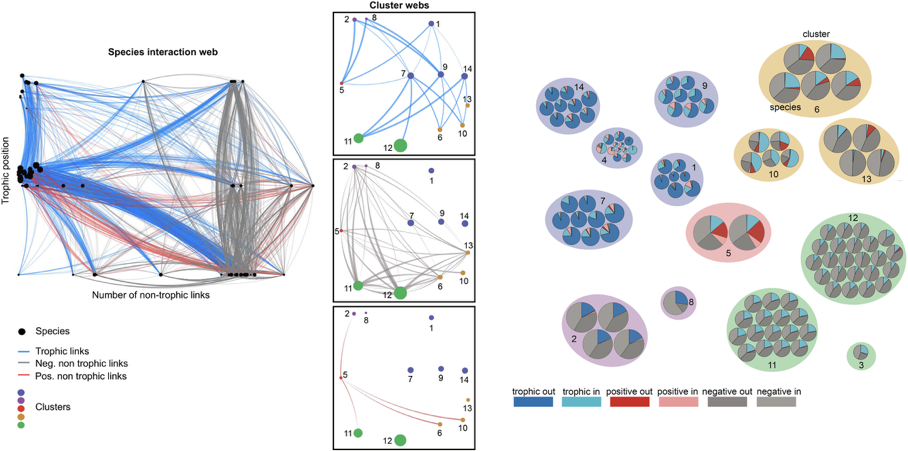
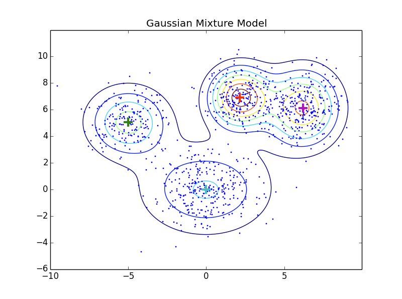
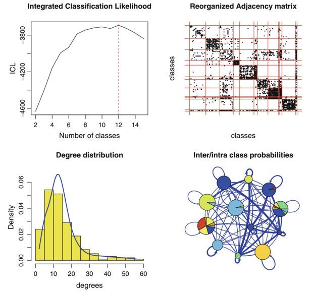
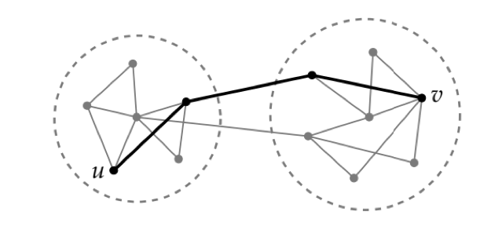

---
layout: true

## Exponential Random Graph Models

---

In ER random graph model edge probabilities were independent of vertex characterisitics.

Now assume vertices have measured attributes. 

Question: what is the effect of these attributes in network formation, specifically in edge occurence.

---

Denote $Y$ as adjacency matrix of graph $G$ over $n$ elements

Denote $X$ as matrix of vertex attributes.

We want to determine $P(Y_{ij}=1|Y_{-(ij)}=y_{-(ij)}, x_i, x_j, L(G))$

where $L(G)$ is a measure of structure of graph $G$ and $y_{-(ij)}$ is the _configuration_ of edges other than edge $i\sim j$

---
class: split-50

We can motivate ERGM model from regression (where outcome $Y$ is continuous)

.column[
$$E[Y_i|x_i] = \sum_{j=1}^p \beta_j x_{ij} = \beta'x_i$$
]

.column[
.center[]
]

---
class: split-50

We turn into a probabilistic model as

.column[
$$Y=\beta'x_i + \epsilon$$

$$\epsilon \sim N(0,\sigma^2)$$
]

.column[
.center[]
]

---

For _binary_ outcome $Y$ we use _logistic regression_

.center[]

$$\log\frac{P(Y_i=1|x_i)}{1-P(Y_i=1|x_i)} = \beta'x_i$$

Which corresponds to a Bernoulli model of $P(Y_i=1|x_i)$.

---

The outcome of interest in the ERGM model is the _presence_ of edge $y_{ij}=1$.

Use a Bernoulli model with $y_{ij}$ as the outcome.

With vertex attributes and graph structural measure as predictors.

---

Model 1: the ER model

$$\log \frac{P(Y_{ij}=1|Y_{-(ij)}=y_{-(ij)})}{P(Y_{ij}=0|Y_{-(ij)}=y_{-(ij)})} = \theta$$

Thinking of logistic regression: model is a _constant_, independent of rest of graph structure, independent of vertex attributes

---

To fit models we need a _likelihood_, i.e., probability of observed graph, given parameters (in this case $\theta$)

--

Write $P(Y_{ij}=1|...)$ as $p$, then likelihood is given by

$$\mathcal{L}(\theta;y) = \prod_{ij} p^{y_{ij}}(1-p)^{(1-y_{ij})}$$
---

(Exercise)

$$\mathcal{L}(\theta;y)=\frac{1}{\kappa}\exp\{\theta L(y)\}$$

where $L(y)$ is the number of edges in the graph.

This is the formulation given in reading!

---
class: split-30

.column[
```{r, echo=FALSE, message=FALSE, warning=FALSE}
library(sand)
library(tidygraph)
library(ggraph)
library(tidyverse)

data(lazega)
lazega <- upgrade_graph(lazega)
lazega_tbl <- as_tbl_graph(lazega)
as_data_frame(lazega_tbl, what="vertices") %>%
  glimpse()
```
]

```{r, echo=FALSE, fig.width=6, fig.height=5, fig.align="center"}
lazega_tbl %>%
  ggraph(layout="kk") +
    geom_edge_fan() +
    geom_node_point(aes(color=factor(Practice)), size=5) +
    theme_graph(foreground=NULL)
```

---
class: split-70

.column[
```{r, echo=TRUE, message=FALSE}
library(ergm)
A <- get.adjacency(lazega)
lazega.s <- network::as.network(as.matrix(A), directed=FALSE)
ergm.bern.fit <- ergm(lazega.s ~ edges)
ergm.bern.fit
```
]

.column[
```{r, echo=FALSE}
theta <- ergm.bern.fit$coef[1]
p_er <- plogis(theta)
```

So $\theta=`r format(theta,digits=3)`$

and thus $p=`r format(p_er, digits=3)`$
]


---

```{r, echo=FALSE}
gof.lazega.bern <- gof(ergm.bern.fit)
```

```{r, echo=FALSE, fig.width=12, fig.height=6, fig.align="center"}
oldpar <- par(mfrow=c(1,3),oma=c(0.5,2,1,0.5))
plot(gof.lazega.bern)
```


---
class: split-50

The ER model is not appropriate, let's extend with more graph statistics.

.column[


$S_k(y)$: number of $k$-stars
]

.column[
.center[]
$T_k(y)$: number of $k$-triangles 
]

---

In practice, instead of adding terms for structural statistics at all values of $k$, they are combined into a single term

For example _alternating $k$-star counts_

$$\mathrm{AKS}_{\lambda}(y) = \sum_{k=2}^{N_v-1} (-1)^k \frac{S_k(y)}{\lambda^{k-2}}$$

$\lambda$ is a parameter that controls decay of influence of larger $k$ terms. Treat as a hyper-parameter of model

---

Another example is _geometrically weighted degree count_

$$\mathrm{GWD}_{\gamma}(y) = \sum_{d=0}^{N_v-1} e^{-\gamma d}N_d(y)$$

There is a good amount of literature on definitions and properties of suitable terms to summarize graph structure in these models

---

In addition we want to adjust edge probabilities based on vertex attributes

For edge $i \sim j$, $i$ may have attribute that increases degree (e.g., seniority)

Or, $i$ and $j$ have attributes that _together_ increase edge probability (e.g., spatial distance in an ecological network)

---

We can add attribute terms to the ERGM model accordingly. E.g.,

- Main effects: $h(x_i,x_j)=x_i + x_j$
- Categorical interaction (match): $h(x_i,x_j)=I(x_i == x_j)$
- Numeric interaction: $h(x_i,x_j)=(x_i-x_j)^2$

---

```{r setattrs, echo=FALSE}
v.attrs <- get.data.frame(lazega, what="vertices")

lazega.s <- network::set.vertex.attribute(lazega.s, "Office", v.attrs$Office)
lazega.s <- network::set.vertex.attribute(lazega.s, "Practice", v.attrs$Practice)
lazega.s <- network::set.vertex.attribute(lazega.s, "Gender", v.attrs$Gender)
lazega.s <- network::set.vertex.attribute(lazega.s, "Seniority", v.attrs$Seniority)
```

A full ERGM model for this data:

```{r setmodel, dependson=c("setattrs")}
lazega.ergm <- formula(lazega.s ~ edges + gwesp(log(3), fixed=TRUE) +
  nodemain("Seniority") +
  nodemain("Practice") +                         
  match("Practice") +
  match("Gender") +
  match("Office"))
```

```{r fitergm, echo=FALSE, dependson=c("setmodel")}
set.seed(42)
lazega.ergm.fit <- ergm(lazega.ergm)      
```

---

```{r, echo=FALSE, dependson=c("fitergm")}
library(broom)
glance(lazega.ergm.fit)
```

---

```{r, echo=FALSE, dependson=c("fitergm")}
tidy(lazega.ergm.fit) %>%
  knitr::kable("html")
```

---
```{r gofergm, echo=FALSE, dependson=c("fitergm")}
gof.lazega.ergm <- gof(lazega.ergm.fit)
```

```{r, echo=FALSE, fig.width=12, fig.height=6, fig.align="center", dependson=c("gofergm")}
oldpar <- par(mfrow=c(1,3),oma=c(0.5,2,1,0.5))
plot(gof.lazega.ergm)
```

---

A few more points:

The general formulation for ERGM is

$$P_{\theta}(Y=y) = \frac{1}{\kappa} \exp \left\{ \sum_H g_H(y) \right\}$$

where $H$ represents possible _configurations_ of possible edges among a subset of vertices in graph

$g_H(y) = \prod_{y_{ij}\in H} y_{ij}=1$ if configuration $H$ occurs in graph

---

This brings about some complications since it's infeasible to define function over all possible configurations

Instead, collapse configurations into groups based on certain properties, and count the number of times these properties are satisfied in graph

Even then, computing normalization term $\kappa$ is also infeasible, therefore use sampling methods (MCMC) for estimation

---
layout: true

## Stochastic Block Models

---

.center.middle[]

.source[https://doi.org/10.1371/journal.pbio.1002527]

---

Method to cluster vertices in graph

Assume that each vertex belongs to one of $Q$ classes

Then probability of edge $i \sim j$ depends on class/cluster membership of vertices $i$ and $j$

---

### Clustered ERGM model

If we knew vertex classes, e.g., $i$ belongs to class $q$ and $j$ belongs to class $r$

$$\log\frac{P(Y_{ij}=1|Y_{-(ij)}=y_{-(ij)})}{P(Y_{ij}=0|Y_{-(ij)}=y_{-(ij)})} = \theta_{qr}$$

---

### Clustered ERGM model

Likelihood is then

$$\mathcal{L}(\theta;y) = \frac{1}{\kappa} \exp \{ \sum_{qr} \theta_{qr} L_{qr}(y) \}$$

with $L_{qr}(y)$ the number of edges $i \sim j$ where $i$ in class $q$ and $j$ in class $r$ 

(a model like `g~match(class)` in ERGM)

---

However, suppose we don't know vertex class assignments...

SBM is a probabilistic method where we maximize likelihood of this model, assuming class assignments are unobserved

---

.image-70.center.middle[]

---

Ingredients:

- $Y_{ij}$ edge $i \sim j$ (binary)
- $z_{iq}$ indicator for vertex $i$ class $q$ (binary)
- $\alpha_q$ prior for class $q$ $p(z_{iq}=1) = \alpha_q$
- $\pi_{qr}$: probability of edge $i \sim j$ where $i$ in class $q$ and $j$ in class $r$

---

With this we can write again a likelihood

$$\mathcal{L}(\theta;y,z)=\sum_i\sum_q z_{iq} \log \alpha_q + \frac{1}{2} \sum_{i\neq j}\sum_{q\neq r} z_{iq}z_{jr}b(y_{ij};\pi_{qr})$$

with $b(y,\pi)=\pi^y(1-\pi)^{(1-y)}$

---

Like similar models (e.g., Gaussian mixture model, Latent Dirichlet Allocation) can't optimize this directly

Instead EM algorithm used:
  - Initialize parameters $\theta$
  - Repeat until "convergence":
    - Compute $\gamma_{iq}=E\{z_{iq} | y; \theta\}=p(z_{iq}| y; \theta)$
    - Maximize likelihood w.r.t. $\theta$ plugging in $\gamma_{iq}$ for $z_{iq}$.

---

Like similar models need to determine number of classes (clusters) and select using some model selection criterion

- AIC
- BIC
- Integrated Classification Likelihood

---

.image-60.center.middle[]

---
layout: true

## Communities

---

If we think of class as _community_ we can see relationship with non-probabilistically community finding methods (e.g., Newman-Girvan)

.center[]

See http://www.pnas.org/content/106/50/21068.full
for comparison of these methods

---
exclude: true
NEWMAN-GIRVAN algorithm

---
exclude: true

COMPARISON TO LATENT AND SBM MODELS

Cite the Bickel paper:
http://www.pnas.org/content/106/50/21068.full


---
layout: false

## Summary

Slightly different way of thinking probabilistically about networks

Define probabilistic model over network configurations

Parameterize model using network structural properties and vertex properties

Perform inference/analysis on resulting parameters

Can also extend classical clustering methodology to this setting

---
exclude: true
layout: true

## Latent Network Models

---
exclude: true

Extension to include attributes.

Drawn from SNA literature to model homophily

